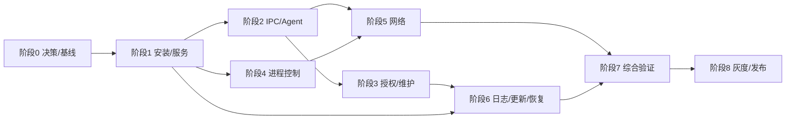

# Winknow V7.0 修改实施计划书（AI 执行版）

> 文档版本：8.0（取代 v2.0，为唯一有效执行版本）
> 编制日期：2026-09-02
> 代码基线：`develop@028c6d394f3b2ca93cb0679678d48de71c5acb46`（阶段 0 须以执行当日最新 develop 提交重新生成基线）
> 配套说明：`docs/WinknowV7_项目说明书_AI分析版.md`
> 已取代：v2.0《WinknowV7_修改实施计划书_AI执行版.md》与《WinknowV7_全链路打通工作计划.md》
>
> v8.0 修订要点：
> ① 周期口径区别人日预算与日历周期（阶段 8 灰度另需 3～4 周日历时间）；
> ② TD-02/P6-03 补充策略版本随更新事务一致回滚，防止新策略与回滚后旧服务不兼容；
> ③ TD-05 管道身份改为可行方案：ACL 允许 Authenticated Users 连接 + 应用层 Impersonation 真实 SID 比对（管道 ACL 不支持按 SID 动态放行）；
> ④ P2-05 键盘钩子降为独立功能开关 `KeyboardPolicyEnabled`，默认关闭，不作为 P2 阶段退出条件；
> ⑤ 覆盖率门禁改为棘轮制（入场基线起步、只升不降、终值 85%/75%）；
> ⑥ B-02 表述修正（Licensing 为类库，真实缺口是 ControlService 未引用它）。
> 计划性质：工程整改、功能闭环、安全加固、测试与发布计划
> 推荐周期：2 名 Windows/.NET 开发 + 1 名测试，开发预算 8～10 周（约 80～100 人日）；单人实施约 14～18 周；阶段 8 灰度另需约 3～4 周日历时间，项目总日历周期约 12～14 周

## 1. 编制目的

本计划用于把当前 Winknow V7.0 从“模块较完整但关键链路未闭环的工程原型”推进为“可在受控 Windows 编程教室内安装、运行、维护、升级和回滚的候选发布版本”。

本计划不以增加新功能数量为主要目标，而以以下结果为核心：

1. 安装包包含全部必要组件，路径、服务名、策略和更新槽位保持一致。
2. ControlService、GuardService、SessionAgent、AdminUI、RecoveryTool 和 TrustedUpdater 形成真实运行闭环。
3. IPC、授权、维护、卸载、更新和恢复具有可验证的身份与信任边界。
4. 进程与网络管控的产品承诺不超过实际技术能力。
5. 每一项安全功能都能通过自动化测试或明确的人工验收步骤证明。
6. CI 不允许“零测试假绿”、高危依赖、漏文件安装包或未签名正式产物通过发布门禁。

## 2. 当前基线与问题摘要

### 2.1 已有基础

- 15 个生产项目、10 个 xUnit 测试项目。
- .NET 8 Windows 专用架构，Nullable、WarningsAsErrors 和中央包版本管理已启用。
- 已有进程扫描、WMI 监听、USB 控制、设备安全评估、维护会话、日志密码学组件、守护退避、A/B 更新和恢复库等代码。
- Release 解决方案可以编译；已有 422 项测试在检查环境中通过。
- 已有 GitHub Actions、PowerShell 发布脚本、Inno Setup 脚本和灰度执行材料。

### 2.2 主要阻断问题

| 编号 | 问题 | 影响 |
|---|---|---|
| B-01 | 安装器内部服务名与代码使用的显示名不一致 | 服务保护、启停、守护、维护和更新可能失败 |
| B-02 | 发布产物缺少 SessionAgent、RecoveryTool；且 ControlService 未引用 Licensing 类库 | 安装后功能不完整，授权未接入核心管控 |
| B-03 | 策略安装路径与 ControlService 查找路径不一致 | 服务退回默认规则或无法应用策略 |
| B-04 | 安装器调用不存在的 `snapshot` 命令 | 安装流程可能失败，Recovery Vault 未建立 |
| B-05 | ControlService 没有启动/管理 SessionAgent | 锁屏、会话交互和键盘策略不工作 |
| B-06 | Named Pipe 身份依赖客户端自报 SID | 可伪造身份，且学生 Agent 默认会被拒绝 |
| B-07 | Licensing 是内存模拟和弱校验 | 不能作为真实授权与锁定边界 |
| B-08 | 网站白名单没有接入实际网络流量 | 产品描述与实际阻断能力不一致 |
| B-09 | 关键进程按名称直接放行，签名验证不完整 | 软件白名单可被绕过 |
| B-10 | AdminUI 维护退出不重启服务，卸载无真实鉴权 | 维护状态不可信，安全策略可被解除 |
| B-11 | 日志加密/哈希链组件未接成持久化管道 | 无法证明审计日志完整性 |
| B-12 | 更新健康检查占位、解压限制不足 | 更新包和回滚链路存在风险 |
| B-13 | 测试 DLL 可执行 0 项但总流程仍成功 | CI 可能假绿 |
| B-14 | 存在 High 级别传递依赖漏洞 | 不满足正式发布门禁 |

## 3. 范围与非目标

### 3.1 本计划范围

- 构建、发布和 Inno Setup 安装链。
- 两个 Windows 服务及其自保护、守护和恢复。
- SessionAgent 的会话生命周期、IPC 和锁屏基础能力。
- 维护认证、卸载授权、设备授权和离线宽限。
- 进程白名单可信判断。
- Chrome/Edge 课堂浏览策略、代理/DNS/VPN 防绕过的可交付范围。
- 审计日志、更新包、A/B 回滚和 Recovery Vault。
- CI、安装测试、安全测试、灰度和发布门禁。

### 3.2 明确非目标

以下能力不应在本轮 8～10 周整改中顺带加入：

- 云端 SaaS 管理后台。
- 跨学校、多租户、互联网设备管理。
- AI 学习行为分析。
- 完整 EDR、杀毒或内核反篡改能力。
- 对本地管理员、SYSTEM 或离线磁盘攻击的绝对防御。
- 通用 HTTPS 内容审查、MITM 解密或网页正文采集。
- 未经单独立项的 WFP 内核 Callout Driver。
- 所有品牌 BIOS 的自动配置修改。

如业务要求“阻断所有进程的非白名单域名流量”，必须单独立项 WFP/受控网关方案，预计增加 3～6 周开发以及驱动签名、HLK/兼容性测试成本。

## 4. 实施前必须冻结的技术决策

这些决策必须在阶段 0 确认，后续 AI 或开发人员不得自行改变产品边界。

### TD-01：服务标识

- 内部服务名固定为 `WinknowControl`、`WinknowGuard`。
- 显示名固定为 `Winknow Control Service`、`Winknow Guard Service`。
- 所有 `ServiceController`、`OpenService`、`sc.exe`、服务注册表路径使用内部服务名。
- UI 和日志可以使用显示名。
- 在 `Winknow.Core` 建立唯一的 `ServiceNames` 常量，禁止各项目重复硬编码。

### TD-02：程序、策略和数据路径

- 服务程序：`%ProgramData%\Winknow\deploy\Current`。
- 默认/生效策略：`%ProgramData%\Winknow\policies\active_policy.json`。
- 策略签名：同目录 `active_policy.sig`，或使用包含签名字段的统一封装格式。
- 维护配置：`%ProgramData%\Winknow\maintain`。
- 日志与密钥：`%ProgramData%\Winknow\logs`、`%ProgramData%\Winknow\keys`。
- AdminUI 和常驻 Updater：`%ProgramFiles%\Winknow`。
- 所有路径集中在 `Winknow.Core.ProductPaths`，支持测试时注入临时根目录。
- 策略与二进制版本必须在更新事务中保持一致：`active_policy.json` 的激活版本由更新编排管理，apply/rollback 时随事务一并切换（见 P6-03 第 8 条）。

### TD-03：V7 网络能力边界

推荐 V7 采用“受管浏览器策略”而不是声称“全系统域名白名单”：

- Chrome/Edge 使用企业策略 `URLBlocklist=["*"]` 和 `URLAllowlist`。
- 禁止浏览器自定义代理、DoH、安全 DNS和非授权扩展。
- 使用应用白名单限制其他浏览器、VPN、代理工具和脚本解释器。
- 对系统代理、PAC、DNS、虚拟网卡做检测、恢复与审计。
- UI/文档明确：V7 保证受管浏览器课堂访问范围，不承诺所有第三方进程的域名级过滤。

若产品坚持全系统域名白名单，本计划在阶段 5 设置架构停止点，转为单独的 WFP/网关项目。

### TD-04：V7 授权模式

推荐 V7 固定为“教师机 LAN 授权 + 学生机离线宽限”，云端保持接口但不进入发布范围：

- 教师侧保存授权签名私钥或调用受保护的本地签名服务。
- 学生端只保存验证公钥和设备私有随机 Secret。
- 教师机签发短期签名 Token，学生机离线保存最近有效 Token。
- 网络不可达时进入有限宽限，宽限结束显示锁屏，但不得关闭安全管控服务。
- 不再接受任意固定码，不从公开 DeviceId 派生动态码 Secret。

### TD-05：IPC 身份

- Named Pipe ACL 在创建时一次性设置：允许 SYSTEM、Administrators、Authenticated Users 以最小读写权限连接（管道 ACL 不支持按 SID 动态放行）。
- "已登记学生会话"的准入不在 ACL 层实现，而在应用层完成：服务端从 Pipe Impersonation Token 获取真实 SID，与会话登记表比对，不信任消息体的 `SenderSid`。
- 首次连接执行握手，绑定协议版本、会话 ID、进程 ID、设备 ID 和随机挑战。
- RequestId 单调性以单连接或协商后的连接会话为范围，重连不会永久误判。

### TD-06：代码与策略信任

- Windows 可执行文件使用 Authenticode，并通过 `WinVerifyTrust` 校验。
- 对端验证固定证书公钥哈希或明确的发布证书链，不只检查 Subject 文本。
- 更新包和策略使用独立 RSA/ECDSA 发布密钥签名。
- 正式客户端不包含任何生产签名私钥。
- 测试证书和正式证书的信任配置必须完全隔离。

### TD-07：失败模式

- 安全组件无法初始化时，进入可观察的 Degraded 状态并写事件日志。
- 不允许因策略损坏、代理检测失败或更新失败而静默“全部放行”。
- 也不允许未经验证的无限阻断导致教学电脑无法恢复；必须保留有双因子保护的本地维护通道。

### TD-08：Recovery Vault 信任来源

- Recovery 快照只能由通过正式签名/Hash 验证的安装包或已提交成功的更新版本建立。
- GuardService 不得在清单缺失时自动把当前未知文件视为可信基线。
- 快照刷新必须产生审计事件，并保存来源版本和发布清单摘要。

## 5. 总体阶段计划

| 阶段 | 名称 | 预计工作量 | 前置依赖 | 主要交付物 |
|---|---|---:|---|---|
| 0 | 基线冻结与架构决策 | 2～3 人日 | 无 | 决策记录、可复现基线、风险台账 |
| 1 | 构建、发布、安装与服务统一 | 6～8 人日 | 阶段 0 | 可编译安装包、完整 payload、服务/策略闭环 |
| 2 | IPC 与 SessionAgent 闭环 | 10～12 人日 | 阶段 1 | 真实会话 Agent、认证 IPC、锁屏命令闭环 |
| 3 | 维护、卸载与授权安全 | 12～15 人日 | 阶段 2 | 可信维护票据、授权 Token、离线宽限 |
| 4 | 进程管控可信化 | 8～10 人日 | 阶段 1 | 可信进程身份、Hash/学生产物规则 |
| 5 | 网络管控可交付化 | 10～14 人日 | 阶段 0、2、4 | 受管浏览器白名单和防绕过闭环 |
| 6 | 日志、守护、更新与恢复加固 | 10～12 人日 | 阶段 1、3 | 统一审计、安全更新、可信恢复 |
| 7 | 自动化、兼容性与安全验证 | 12～15 人日 | 阶段 1～6 | 测试门禁、VM 矩阵、攻击用例报告 |
| 8 | 灰度与正式发布 | 7～10 人日 | 阶段 7 | 签名发布包、灰度报告、回滚包 |

阶段 2 与阶段 4可在不同开发人员之间部分并行；阶段 5 必须等进程控制和 Agent 身份边界稳定后再进入系统集成。



## 6. 阶段 0：基线冻结与架构决策

### 目标

在开始修改前建立唯一事实基线，避免多个 AI 或开发人员依据不同文档同时修改相互冲突的架构。

### 任务

| ID | 任务 | 涉及范围 | 工时 | 验收 |
|---|---|---|---:|---|
| P0-01 | 固定分支、提交、SDK 和包锁定策略 | 根目录、CI | 0.5 日 | 干净机器可按记录恢复相同依赖 |
| P0-02 | 审批 TD-01～TD-08 | 架构/产品 | 0.5 日 | 形成 ADR 文档，无未决 P0 决策 |
| P0-03 | 建立问题和需求追踪表 | GitHub Issues/项目板 | 0.5 日 | 每个任务有 ID、负责人、状态和验收人 |
| P0-04 | 建立基线验证脚本 | `tools/`、CI | 1 日 | 一条命令输出 SDK、构建、测试数、漏洞和 payload 检查 |

### 建议新增文件

- `docs/adr/ADR-001-service-and-paths.md`
- `docs/adr/ADR-002-network-scope.md`
- `docs/adr/ADR-003-licensing-and-keys.md`
- `tools/Verify-Baseline.ps1`

### 阶段退出条件

- TD-01～TD-08 已由产品负责人和技术负责人确认。
- `develop` 分支构建可复现。
- 已记录当前测试程序集数量和每个程序集的实际测试数。
- 未决项不会改变后续数据格式、部署路径或安全信任模型。

### 回滚

本阶段只新增文档和验证脚本；删除相应提交即可回滚，不改变运行行为。

## 7. 阶段 1：构建、发布、安装与服务统一

### 目标

实现“在干净 Windows VM 上安装后，所有必需文件存在、两个服务可启动、策略可加载、管理工具可运行”的最小闭环。

### 任务 P1-01：统一服务标识

涉及文件：

- `src/Winknow.Core/Constants.cs` 或新增 `ServiceNames.cs`；
- `Winknow.ControlService/Program.cs`、`Worker.cs`；
- `Winknow.GuardService/Program.cs`、`Worker.cs`；
- `Winknow.AdminUI/MainWindow.xaml.cs`；
- `Winknow.RecoveryTool/Program.cs`；
- `Winknow.TrustedUpdater/Program.cs`；
- `Winknow.Security/Service*.cs`、`RegistryAclProtector.cs`、`SafeBootRegistrar.cs`；
- `installer/WinknowSetup.iss`。

实施要求：

1. 增加内部名和显示名的集中常量。
2. P/Invoke、ServiceController、SCM、服务注册表路径统一使用内部名。
3. 日志和 UI 使用显示名。
4. 增加静态架构测试，禁止生产项目再次出现服务名字符串字面量。

验收标准：

- `sc.exe query WinknowControl` 和 `sc.exe query WinknowGuard` 成功。
- 两服务能被代码启动、停止、查询和配置恢复动作。
- SafeBoot 和服务 ACL 写入正确的内部服务注册表项。

### 任务 P1-02：集中产品路径

实施要求：

1. 新增 `ProductPaths`，通过构造参数允许测试根目录覆盖。
2. Control、Guard、Updater、Recovery、AdminUI 不再各自拼接 ProgramData 路径。
3. 统一策略、日志、密钥、维护、授权和部署槽位路径。
4. 对目录创建 ACL：SYSTEM/Administrators 写，标准用户仅获必要读取或完全无权访问敏感目录。

验收标准：

- 安装后路径清单与 TD-02 一致。
- 标准用户不能修改策略、密钥、恢复库、维护配置或服务文件。
- 所有路径类可以在临时目录中完成单元测试。

### 任务 P1-03：修复发布 payload

修改 `installer/Build-Release.ps1` 和 `obfuscar.xml`：

- 发布 ControlService、GuardService、SessionAgent、AdminUI、TrustedUpdater、RecoveryTool。
- 确保所有被引用类库随对应入口发布，包含 Licensing。
- 策略复制到安装器期望路径结构。
- release manifest 排除临时备份、混淆中间目录和私钥。
- 增加“必需文件列表”验证，缺一项立即失败。

必需文件至少包括：

- 两个服务 EXE/DLL；
- SessionAgent EXE/DLL；
- AdminUI EXE/DLL；
- TrustedUpdater EXE/DLL；
- RecoveryTool EXE/DLL；
- Licensing、Ipc、Policy、Security、Logging 等依赖 DLL；
- 默认策略；
- 版本文件、发布清单和正式公钥。

### 任务 P1-04：修复安装器

1. 删除无效或未证实的 Inno Setup 声明段。
2. 使用 `[Run]` 或安装器代码可靠创建服务，并检查退出码。
3. 实现 `snapshot` 命令，或改为安装器直接调用已有可信初始化命令；不得继续调用不存在的命令。
4. 安装失败时删除本次新建服务和新文件，保留已有稳定版本。
5. 安装日志写入管理员可导出的固定位置。
6. 卸载流程暂时标为“仅维护授权票据可启动”，具体票据在阶段 3 完成。

### P1 测试

- 干净 Windows 10、Windows 11 VM 首次安装。
- 缺少 .NET Desktop Runtime 时的提示/阻断。
- 已安装同版本、覆盖安装、低版本升级。
- 安装中断、电源中断模拟、磁盘空间不足。
- 标准用户读取/修改 ProgramData 各目录的权限测试。
- 安装后重启，服务自动启动且 Control 心跳有效。

### P1 阶段退出条件

- Inno Setup 在 CI 或受控构建机真实编译成功。
- 安装包中必需文件 100% 存在。
- 两服务连续重启 3 次均正常；策略加载日志显示正确 PolicyId。
- 安装/卸载脚本没有不存在的命令。
- 本阶段 P0/P1 缺陷为 0。

### P1 回滚

- 保留安装前的 `Current` 和服务配置快照。
- 安装脚本失败时恢复原服务 binPath 和启动类型。
- 发布脚本变更使用单独提交，可回退到旧 payload 逻辑进行问题定位，但旧包不得用于正式部署。

## 8. 阶段 2：IPC 与 SessionAgent 闭环

### 目标

让每个活动学生会话拥有一个真实 Agent，并能通过可信 Named Pipe 接收锁定/解锁、策略更新和退出命令。

### 任务 P2-01：重构 IPC 身份认证

涉及文件：`IpcServer.cs`、`IpcClient.cs`、`IpcAuthenticator.cs`、`IpcMessage.cs`、`IpcConstants.cs`。

实施要求：

1. 服务端通过 Pipe impersonation 获取真实 WindowsIdentity/SID。
2. 删除以消息 `SenderSid` 作为身份凭证的逻辑；可以保留该字段用于审计，但必须与真实 SID 比对。
3. Pipe ACL 允许 Authenticated Users 以最小权限连接；已登记学生 SID 的准入在应用层按 Impersonation 真实 SID 比对，不动态修改 ACL。
4. 增加握手消息：协议版本、PID、SessionId、DeviceId、ClientNonce、ServerNonce。
5. 为每条消息增加最大 Payload 限制和严格长度检查。
6. RequestId 防重放以连接会话为边界；重连产生新 SessionNonce。
7. 使用固定时间比较验证敏感摘要。

验收：

- 伪造 SenderSid 不能取得更高权限。
- 非登记标准用户不能连接；登记学生会话可以连接。
- 重放、过期时间戳、重复 Nonce、降级协议、超长 Payload 被拒绝并审计。
- 正常断线重连不会因 RequestId 重置永久失败。

### 任务 P2-02：实现会话生命周期管理器

建议在 ControlService 新增：

- `SessionManager`；
- `WtsSessionMonitor`；
- `SessionAgentLauncher`；
- `SessionRegistry`。

实施要求：

1. 服务启动时枚举已有活动交互会话。
2. 监听登录、解锁、锁定、注销和断开事件。
3. 使用 WTS Token + `CreateEnvironmentBlock` + `CreateProcessAsUser` 启动 Agent。
4. 验证 Agent 路径、Hash 和 Authenticode 后才启动。
5. 每会话只运行一个 Agent；注销时发送退出并等待，超时后仅终止对应可信 Agent。
6. Agent 崩溃重启使用独立限流，不与 ControlService 守护形成重启风暴。

### 任务 P2-03：修复 SessionAgent 运行模型

1. 使用 `Process.GetCurrentProcess().SessionId` 获取 Session ID。
2. 将 Agent 改为真正 WPF 应用或实现标准 Win32 `GetMessage` 消息泵。
3. 保存事件委托实例，正确订阅和退订。
4. 增加优雅退出、服务断线重连和指数退避。
5. 消息类型改为共享 enum，不允许硬编码 `1001`。
6. 锁屏遮罩必须在 UI 线程执行，并覆盖显示器热插拔、DPI 和任务栏变化。

### 任务 P2-04：建立最小消息协议

V7 必需消息：

| 消息 | 方向 | 说明 |
|---|---|---|
| Hello/HelloAck | Agent ↔ Service | 身份和版本握手 |
| Heartbeat | Agent → Service | 会话活性 |
| ApplyPolicy | Service → Agent | 会话级策略版本通知 |
| ShowLock | Service → Agent | 显示锁屏和原因 |
| HideLock | Service → Agent | 已授权解锁 |
| Shutdown | Service → Agent | 注销/更新/维护时退出 |
| Status/StatusAck | 双向 | 查询 Agent 状态和版本 |

每个命令必须有响应、超时和幂等语义。

### 任务 P2-05：会话内键盘与系统入口策略（独立开关，不作为 P2 退出条件）

本任务由功能开关 `KeyboardPolicyEnabled` 控制，默认关闭；P2 阶段退出不依赖本任务，可在阶段 7 完成攻击与恢复性验证后按灰度策略启用。低级键盘钩子存在永久键盘失效与杀毒软件拦截风险，启用前必须满足本节全部可恢复性要求。

1. 对可拦截快捷键使用低级键盘钩子，但钩子只运行在 SessionAgent 的交互会话。
2. Ctrl+Alt+Delete 等 Secure Attention Sequence 不得宣称可由普通钩子拦截，应通过 Windows 账户、组策略和系统入口配置限制相关操作。
3. Ctrl+Shift+Esc、Win+R、Win+X 等限制必须与当前策略模式关联；Ctrl+C/V/Z 等编程必需按键默认保留。
4. 钩子安装失败、Agent 崩溃或策略更新时必须可恢复，不得造成永久键盘失效。
5. 记录策略版本和被阻止快捷键类型，不记录学生实际输入内容。
6. 维护模式进入后可靠卸载钩子，退出后重新应用并验证状态。

### P2 测试与验收

- 同一用户快速登录/注销 50 次不残留 Agent。
- 两个并发用户会话各只有一个 Agent，消息不会串会话。
- RDP/控制台切换、锁屏/解锁、睡眠唤醒后自动恢复。
- 服务重启后 Agent 可重连，Agent 重启不影响主服务。
- 标准用户不能伪造管理员命令。
- 4K/高 DPI/双显示器锁屏显示正常。
- IPC 断线、半包、乱码、超大包、重放和超时均有测试。
- （仅当 `KeyboardPolicyEnabled` 启用时）普通学习模式和严格考试模式的快捷键矩阵逐项通过，且不采集按键正文。
- （仅当 `KeyboardPolicyEnabled` 启用时）Agent 被强制结束后不会遗留失效钩子或永久键盘阻塞。

### P2 回滚

- SessionManager 使用功能开关 `SessionAgentEnabled`。
- 灰度阶段出现 Agent 不稳定时可关闭会话 UI，但核心进程/USB管控继续运行。
- 不得通过删除 Agent 文件或放宽 Pipe ACL 作为临时修复。

## 9. 阶段 3：维护、卸载与授权安全

### 目标

把当前演示性的维护和授权逻辑替换为可验证的身份流程，并保证授权失效不会关闭核心安全服务。

### 任务 P3-01：维护配置保护

1. TOTP Secret 使用 DPAPI LocalMachine 保护。
2. `maintain.json` 只保存版本、密码哈希参数、DPAPI 密文和密钥版本。
3. 维护密码增加复杂度、失败次数、指数延迟和短期锁定。
4. 恢复码继续只存哈希，用后原子失效。
5. 对配置和恢复码文件设置 SYSTEM/Administrators ACL。
6. 支持密钥轮换和旧格式迁移，迁移失败不得覆盖原文件。

### 任务 P3-02：统一 MaintenanceCoordinator

目前 AdminUI 和 RecoveryTool 各自实现服务启停。应抽出单一协调器：

1. 验证身份。
2. 写维护票据，包含随机 ID、操作者、原因、开始/到期、目标设备和 HMAC。
3. 通知 Guard 暂停拉起。
4. 停止 Control/Guard，并验证两者确实停止。
5. 维护结束/超时时恢复服务并验证心跳。
6. 只有全部成功后 UI 才显示对应状态。
7. 任何失败返回明确错误，不吞异常。

### 任务 P3-03：卸载授权

1. Inno Setup 卸载前调用 RecoveryTool 生成/验证一次性维护票据。
2. `uninstall --yes` 不得绕过身份验证；自动化卸载需要短期签名票据参数。
3. 卸载审计必须在删除数据库前写入并导出 Windows Event Log 锚点。
4. 明确保留或删除审计数据的选项和权限。
5. 卸载失败时不得留下“服务删除一半、策略解除一半”的状态。

### 任务 P3-04：真实 LAN 授权协议

1. 删除测试设备自动初始化。
2. 将教师机授权端点与 AdminUI 进程内对象解耦，定义持久化设备名单。
3. 令牌至少包含：ProductId、DeviceId、IssuedAt、ExpiresAt、PolicyVersion、Nonce、KeyId。
4. 使用 RSA-PSS 或 ECDSA 签名；学生端只含公钥。
5. LAN 传输使用 TLS 或签名请求/响应，并校验教师机身份。
6. 离线宽限 Token 使用 DPAPI 保存，防止回拨系统时间延长宽限。
7. CloudProvider 明确返回 NotSupported，不得模拟成功。

### 任务 P3-05：锁定/解锁闭环

- 授权过期：ControlService 保持运行，向对应 Agent 下发 ShowLock。
- 教师解锁：教师端签发短期、一次性、绑定设备和挑战值的 UnlockGrant。
- 学生端验证签名、DeviceId、有效期、Nonce 后下发 HideLock。
- 删除任意长度固定码和由 DeviceId 派生 TOTP Secret 的代码。
- 所有锁定、解锁、失败尝试写审计日志。

### P3 测试与验收

- 错误密码、错误 TOTP、旧 TOTP、恢复码重用和暴力尝试均被拒绝。
- UI/CLI 维护进入后服务确实停止；退出和超时后心跳恢复。
- 卸载无票据失败，有效票据一次成功，票据过期或重用失败。
- 伪造 Token、篡改 DeviceId、过期 Token、错误 KeyId 被拒绝。
- 教师机离线时按设定进入宽限，宽限结束锁屏但核心管控持续。
- 调整系统时间不能无限延长授权。

### P3 回滚

- 新授权格式使用版本字段；迁移期间可以读取旧 Token，但不得信任旧模拟签名进入正式环境。
- 正式发布前清理所有测试授权和测试私钥。
- 若教师端不可用，可通过管理员维护授权恢复，不得设置通用后门码。

## 10. 阶段 4：进程管控可信化

### 目标

消除按名称放行、伪证书 Subject 和宽路径规则造成的主要绕过路径。

### 任务 P4-01：进程身份与签名

1. 使用规范化最终路径，处理环境变量、短文件名、大小写、符号链接和重解析点。
2. 使用 `WinVerifyTrust` 验证 Authenticode 完整性、证书链和签名状态。
3. 策略发布者规则绑定证书公钥哈希或受信根/发布者组合，而非 Subject 字符串。
4. 核心 Windows 进程必须同时满足系统目录、受信 Microsoft 签名和预期文件属性。
5. Winknow 自身组件必须位于 Current 槽、签名可信且 Hash 与 manifest 匹配。

### 任务 P4-02：完整策略规则

- 实现 `ByHash`。
- 路径规则增加是否允许子目录、是否要求签名、是否允许用户可写位置等字段。
- 学生编译产物必须同时满足允许目录、最大大小、生成时间/首次观察时间和扩展名策略。
- 高风险解释器优先级高于普通路径/发布者白名单；只有显式管理例外才能运行。
- 规则冲突采用“明确拒绝 > 精确 Hash 允许 > 签名允许 > 受限路径允许 > 默认拒绝”。

### 任务 P4-03：稳定性与审计

- 空路径、进程快速退出、访问拒绝、受保护进程和签名 API 错误不得抛出未处理异常。
- Judge 返回结构化决策：RuleId、ReasonCode、Evidence、PolicyVersion。
- 终止失败必须记录原因并进入后续扫描重试限流。
- 对同一进程/规则的日志做抑制，避免 2 秒扫描造成日志洪水。

### P4 测试矩阵

| 用例 | 预期 |
|---|---|
| 恶意文件改名 `svchost.exe` | 拒绝 |
| 恶意文件改名 `Winknow.ControlService.exe` | 拒绝 |
| 篡改已签名文件一个字节 | 签名失效并拒绝 |
| Subject 相同但证书不同 | 不匹配固定公钥并拒绝 |
| 用户可写目录放置 Microsoft 名称文件 | 拒绝 |
| 符号链接指向不允许目录 | 按最终路径拒绝 |
| 合法 Visual Studio/编译器 | 允许 |
| 合法学生输出超过 50 MB 或过期 | 拒绝 |
| WMI 断线期间启动程序 | 周期扫描发现并处理 |

### P4 性能门禁

- 常态空闲 CPU 平均低于 1%。
- 2 秒全量扫描不造成明显 UI 卡顿。
- 签名/Hash 使用缓存，缓存键至少包含文件 ID、大小和最后写入时间。
- 1,000 个进程样本判断 P95 小于 100 ms（不含首次网络证书吊销查询）。

### 任务 P4-04：设备安全与 USB 验收加固

1. 自动检测失败必须返回 Unknown/需人工核验，不能把“读取失败”解释为“已通过”。
2. 固件厂商、版本、Secure Boot、UEFI/Legacy 和启动配置变化应使旧核验记录失效。
3. USBSTOR 策略写入后必须回读验证；失败时在 UI 和审计中明确显示。
4. 人工核验记录包含管理员、时间、设备 ID、固件指纹、结论、备注和下次复检日期。
5. 导出的 MD/CSV 报告标明自动检测、人工结论和未知项，不能只显示聚合分数。
6. 至少在 Dell、HP、Lenovo 或实际机房覆盖的 3 个品牌上验证 BIOS 菜单指引；不支持的型号使用通用人工清单。
7. 验证禁用 USB Mass Storage 不影响键盘、鼠标和批准的 HID 设备。

设备安全退出条件：

- Secure Boot 开/关、不支持、读取失败四类状态显示正确。
- 固件升级或主板信息变化后强制重新核验。
- USB 存储禁用/恢复在重启后仍与策略一致。
- 报告中的每个分数都可追溯到原始检查项和证据类型。

### P4 回滚

- 策略格式升级支持最后可用策略回滚。
- 新 Judge 可由 Feature Flag 切回旧 Judge 仅用于灰度诊断；正式发布前必须移除默认旧路径。
- 错误阻断时通过维护模式导入已签名修复策略。

## 11. 阶段 5：网络管控可交付化

### 目标

形成“受管 Chrome/Edge 只能访问课堂允许站点，学生不能通过常见代理、DoH、VPN 或其他浏览器轻易绕过”的可测试闭环。

### 任务 P5-01：受管浏览器 URL 策略

1. 将域名包转换为 Chrome/Edge `URLAllowlist`。
2. 设置 `URLBlocklist=["*"]`。
3. 覆盖主域名、子域名、登录、API、静态资源、CDN 和提交端点。
4. 设置策略刷新并验证浏览器实际读取状态。
5. 浏览器更新后运行健康用例，避免策略键变更导致静默失效。

### 任务 P5-02：按用户应用策略

- 枚举交互用户 SID，并加载/写入对应 HKU 配置单元。
- 不再让 LocalSystem 的 HKCU 代表学生用户。
- 登录新用户时立即应用策略，注销后释放 Hive 句柄。
- 对本地管理员账号是否应用策略由明确配置决定。

### 任务 P5-03：代理、PAC、DNS 和 DoH

- 同时检查 HKLM、各学生 HKU 的代理设置。
- 监控 ProxyEnable、ProxyServer、AutoConfigURL 和 PAC 文件 Hash。
- Browser Policy 禁用 DoH/Secure DNS；验证 `chrome://policy` / `edge://policy` 对应状态。
- DNS 检查从启动时一次改为事件触发 + 周期检查。
- 发现偏差时恢复、通知、审计；连续恢复失败进入网络 Degraded。

### 任务 P5-04：VPN/TUN 和替代客户端

- 默认维护已知进程、服务、驱动和网卡特征库。
- 发现阻断对象时执行明确动作：终止进程、禁用服务或禁用适配器需要分别授权和审计。
- 其他浏览器、curl、wget、PowerShell、脚本解释器由软件管控限制。
- 不对不可识别虚拟网卡自动禁用，避免影响 Hyper-V、校园认证和辅助设备；进入人工核验队列。

### 任务 P5-05：网站包健康验证

每个网站包必须包含：

- 首页；
- 登录；
- 静态资源/CDN；
- API；
- 代码提交/结果查询；
- 必需第三方认证域名。

发布策略前自动运行 Playwright 或人工浏览器流程，验证登录、图片、编辑器和提交。仅 HTTP 状态码可达不能代替业务流程验证。

### P5 验收

- 受管 Chrome/Edge 访问白名单站点完整业务流程成功。
- 访问未授权域名被浏览器策略阻断。
- 修改代理、PAC、DoH、DNS 后在规定时间内恢复并记录。
- 常见 VPN/代理工具无法在学生标准用户下运行。
- IPv4/IPv6 行为一致。
- LocalSystem HKCU、普通学生 HKCU 和管理员 HKCU 的边界测试通过。
- 文档明确不承诺未受管进程的全系统域名级过滤。

### P5 架构停止条件

如果验收要求包括“任意程序、任意协议、任意用户均只能连接域名白名单”，停止当前阶段并创建 WFP/网关项目，不得用 hosts 文件或轮询注册表冒充全流量强制能力。

### P5 回滚

- 策略应用前保存浏览器和代理注册表快照。
- 维护模式可恢复最后可用网络策略。
- 新网站包出现资源遗漏时回滚整个签名策略版本，不在客户端临时增加未审计域名。

## 12. 阶段 6：日志、守护、更新与恢复加固

### 任务 P6-01：统一审计写入管道

建议新增 `AuditEvent`、`AuditWriter`、`AuditVerifier`：

1. 事件先经过 PrivacyPolicy 字段过滤。
2. 敏感正文使用 AES-256-GCM。
3. SQLite 追加写入事件索引、密文、PreviousHash 和 CurrentHash。
4. 每 100 条创建 HMAC 检查点，并把摘要锚定到 Windows Event Log。
5. 写入失败时进入受限缓冲并发告警，不允许无限内存增长。
6. 支持完整性验证和带验证状态的 CSV 导出。

接入事件至少包括：服务启动/停止、策略加载、进程阻断、网络偏差、USB 策略、Agent 登录/退出、授权、维护、更新和恢复。

### 任务 P6-02：守护可信化

- Guard 使用统一内部服务名。
- PeerVerifier 改用 `WinVerifyTrust` 和证书固定。
- 区分服务停止、僵死、版本不兼容、文件篡改和更新窗口。
- Safe Degraded 不能只记录状态；至少持续审计、保持已应用系统策略并提供受保护恢复入口。
- 重启原因、次数、退避和修复结果写统一审计。

### 任务 P6-03：安全更新包

1. 解压到唯一临时目录。
2. 在写文件前拒绝绝对路径、`..`、重解析点和目标目录逃逸。
3. 限制文件数、单文件大小、总解压大小和压缩比。
4. manifest 必须列出所有允许文件；包中额外文件导致失败。
5. 签名、ProductId、版本、兼容矩阵和 Hash 全部通过后才进入槽位切换。
6. 停服务失败立即中止，不吞异常。
7. Agent、Policy、Control、Guard 版本和健康探针全部真实执行。
8. 更新事务状态文件必须记录 PolicyVersion：apply 成功后激活新策略；rollback 时连同策略一并回滚到上一可用版本，防止新策略字段与回滚后的旧服务不兼容导致策略加载失败退回默认。

### 任务 P6-04：Recovery Vault

- 首次快照只从已签名安装 payload 创建。
- 更新成功且健康检查通过后刷新快照。
- manifest 自身签名或包含于发布签名清单。
- 恢复后再次验证 Hash 和 Authenticode。
- 增加 `snapshot --source --manifest` 管理命令，或由内部 API完成；禁止无清单快照。

### P6 故障注入

- 更新包签名错误、Hash 错误、额外文件、Zip Slip、压缩炸弹。
- 停服务失败、启动失败、Agent 健康失败、策略解析失败。
- Current 切换后断电、数据库迁移中断、Recovery 文件损坏。
- 心跳过期、Control 僵死、连续崩溃 20 次。
- 日志 DB 锁定、磁盘满、密钥不可解密、哈希链中间记录被改动。

### P6 验收

- 任一更新失败都回到唯一可启动的稳定 Current。
- 不出现 Current/Previous 同时为空。
- 未签名、降级、额外文件或越界路径包 100% 被拒绝。
- 守护不会与更新器交叉拉起服务。
- 审计篡改可定位首个断裂点；导出显示完整性状态。

### P6 回滚

- 保留 Previous、Recovery 和数据库迁移前快照。
- 更新编排每一步写事务状态文件，启动时可以恢复未完成事务。
- 密钥格式升级保留旧 key version 的只读解密能力，确认迁移后再销毁旧密钥。

## 13. 阶段 7：自动化、兼容性与安全验证

### 13.1 CI 门禁

CI 必须增加：

1. `dotnet format --verify-no-changes` 或等效格式检查。
2. Release build，0 warning、0 error。
3. 每个测试程序集单独执行并解析 TRX，执行数量必须大于 0。
4. 统一测试总数基线，测试数异常下降时失败。
5. 覆盖率棘轮门禁：入场基线为核心安全类行覆盖率 ≥ 60%、整体 ≥ 50%，此后每个迭代只升不降；最终目标核心安全类 ≥ 85%、整体 ≥ 75%；高风险分支需分支覆盖。
6. `dotnet list package --vulnerable --include-transitive`，High/Critical 为 0。
7. 安装 payload 必需文件和 manifest 完整性检查。
8. Inno Setup 实际编译。
9. 正式发布分支检查 Authenticode 和发布清单签名。
10. 密钥/Secret 扫描和依赖许可证清单。

### 13.2 测试层次

| 层级 | 目标 | 示例 |
|---|---|---|
| 单元测试 | 纯逻辑和边界 | 策略、版本、Hash、TOTP、路径、规则优先级 |
| 组件测试 | Windows API 封装 | 服务控制、注册表、WMI、DPAPI、签名 |
| 集成测试 | 多组件协作 | IPC、Agent、授权、维护、审计、更新 |
| 安装测试 | 真实 VM 生命周期 | 安装、重启、升级、回滚、卸载 |
| 安全测试 | 绕过与篡改 | SID 伪造、名称伪装、Zip Slip、票据重放 |
| 稳定性测试 | 长时间和故障 | 7 天运行、睡眠唤醒、网络变化、磁盘满 |
| 性能测试 | 资源与响应 | CPU、内存、扫描延迟、Agent 启动 |

### 13.3 Windows 兼容矩阵

- Windows 10 Pro 22H2 x64。
- Windows 11 Pro 当前受支持版本 x64。
- UEFI + Secure Boot 开/关。
- 单显示器、双显示器、100%/150%/200% DPI。
- 中文/英文系统语言。
- 本地标准用户、管理员、多个用户和 RDP 会话。
- Chrome、Edge、Visual Studio、VS Code、Dev-C++ 当前批准版本。
- 常见杀毒软件共存。
- 睡眠、休眠、快速启动、Windows Update 后重启。
- 有网、断网、DNS 故障、代理篡改、IPv6-only/dual-stack。

### 13.4 安全攻击用例

至少包含：

- 进程改名、复制、替换、符号链接、硬链接和用户可写目录逃逸。
- 伪造 Authenticode Subject、过期证书、吊销证书和篡改签名文件。
- Named Pipe 自报管理员 SID、重放消息、旧时间戳和超长消息。
- 维护密码爆破、TOTP 重放、恢复码复用和卸载票据复用。
- 修改系统时间、复制离线 Token 到另一设备。
- 代理/PAC/DNS/DoH/VPN/虚拟网卡绕过。
- 更新包额外文件、路径穿越、超大压缩、版本降级和签名替换。
- 删除心跳、伪造心跳、篡改 Recovery manifest 和破坏 Current。

### 阶段退出条件

- P0/P1 缺陷为 0，P2 缺陷有明确接受记录且不涉及安全边界。
- 所有测试程序集实际执行测试，无 0-test。
- High/Critical 依赖漏洞为 0。
- Windows 10/11 全生命周期测试通过。
- 连续运行 7 天无崩溃、无重启风暴、无策略永久失效。

## 14. 阶段 8：灰度与正式发布

### 14.1 灰度分阶段

| 阶段 | 规模 | 时长 | 目标 |
|---|---:|---:|---|
| S0 | 2 台实验机 | 48 小时 | 安装、重启、服务、Agent、策略和恢复 |
| S1 | 10 台，至少 3 个硬件品牌 | 3 天 | 兼容性、网络、USB、设备安全 |
| S2 | 1 个真实课堂 | 5 个教学日 | 教学业务、性能、误拦截和管理员操作 |
| S3 | 25% 设备批次 | 3～5 天/批 | 更新、监控、回滚和支持流程 |
| 正式 | 其余设备 | 分批 | 受控推广 |

### 14.2 灰度指标

- 服务/Agent 在线率。
- Control/Guard 重启次数。
- 进程误拦截和漏拦截数量。
- 网站业务流程成功率。
- 策略恢复次数、代理/DNS/VPN 告警。
- 平均 CPU、峰值内存、磁盘日志增长。
- 维护进入/退出成功率。
- 更新成功率、自动回滚率和平均恢复时间。
- 学生/教师故障反馈数量和严重度。

### 14.3 自动停止条件

出现任一情况立即暂停扩容：

- 无法通过维护授权恢复的锁死。
- 服务重启风暴或系统启动失败。
- 大面积误杀 IDE、编译器或浏览器。
- 登录、提交、静态资源等核心课堂流程失败率超过 1%。
- 更新导致 Current/Previous 均不可用。
- 未授权用户成功进入维护或卸载。
- 发现可稳定复现的 IPC、签名或授权绕过。

### 14.4 正式发布产物

- 正式签名安装包。
- 对应版本 `.wku` 更新包。
- Release manifest 和 SBOM。
- 策略签名公钥与 KeyId 说明。
- Previous/Recovery 回滚包。
- 部署检查清单、管理员手册和故障恢复手册。
- 测试报告、安全审查报告、已知限制和隐私说明。
- 版本变更日志和升级/降级兼容矩阵。

## 15. 推荐迭代和 PR 拆分

每个 PR 应保持单一目标，避免多个 AI 同时修改同一核心文件。

| PR | 内容 | 主要文件 | 依赖 |
|---|---|---|---|
| PR-01 | ServiceNames + ProductPaths | Core、各入口 | 无 |
| PR-02 | 发布 payload + 安装器修复 | installer、CI | PR-01 |
| PR-03 | IPC 实际 SID + 握手 | Ipc | PR-01 |
| PR-04 | SessionManager + Agent 消息泵 | Control、SessionAgent | PR-03 |
| PR-05 | 维护配置与 Coordinator | Security、AdminUI、Recovery | PR-01 |
| PR-06 | 卸载票据 | Recovery、installer | PR-05 |
| PR-07 | 授权 Token 和 LAN Provider | Licensing、Control、AdminUI | PR-03、PR-04 |
| PR-08 | WinVerifyTrust + 进程规则 | Security、ProcessControl | PR-01 |
| PR-09 | 浏览器与用户 Hive 网络策略 | Network、Control、Policy | PR-04、PR-08 |
| PR-10 | 统一 AuditWriter | Logging、各入口 | PR-05 |
| PR-11 | 更新包/Recovery 加固 | TrustedUpdater、Guard | PR-02、PR-10 |
| PR-12 | CI/安装/安全测试门禁 | tests、CI、canary | PR-02～PR-11 |

每个 PR 必须包含：问题说明、威胁/失败模型、代码变更、测试、人工验证、兼容性、回滚方式和文档更新。

## 16. 人员分工建议

| 角色 | 主要职责 |
|---|---|
| Windows/.NET 开发 A | 安装、服务、IPC、SessionAgent、Windows API |
| Windows/.NET 开发 B | 授权、进程、网络、日志、更新 |
| QA/安全测试 | VM 矩阵、安装、攻击用例、灰度、证据归档 |
| 产品负责人 | 确认网络和授权边界、接受残余风险 |
| 发布管理员 | 正式密钥、签名、SBOM、发布和回滚包 |

单人实施时仍按 PR 顺序执行，不应同时开启超过两个未完成阶段。

## 17. 任务完成定义（Definition of Done）

任一任务只有同时满足以下条件才能标记完成：

1. 代码已合并到目标分支，工作区无未说明文件。
2. Release build 0 warning、0 error。
3. 新增正常、异常、权限边界和故障恢复测试。
4. 相关测试程序集实际执行数量大于 0。
5. Windows 真实环境或 VM 的人工步骤已执行并保存证据。
6. 日志中可以观察成功与失败结果，且不泄露密码、Secret、Token 或恢复码。
7. 安全失败不会静默放行。
8. 有明确回滚方式，并至少演练一次。
9. 项目说明、管理员手册和变更日志同步更新。
10. 不遗留未关联 Issue 的 TODO、临时通用密码或测试私钥。

## 18. 发布门禁

正式版本必须同时满足：

- P0、P1 缺陷为 0。
- 所有入口程序和必需 DLL 均在 payload，且与 manifest 一致。
- 安装器可编译、安装、重启、升级、回滚和卸载。
- Windows 10/11 兼容矩阵通过。
- Control、Guard、Agent 版本和健康检查真实有效。
- 服务、策略、更新包和 Recovery 信任链可验证。
- 维护与卸载必须通过双因子或一次性恢复授权。
- 进程改名、SID 伪造、Token/票据重放、Zip Slip 等关键攻击用例全部失败。
- 受管浏览器白名单业务流程通过，网络能力边界已写入产品说明。
- High/Critical 依赖漏洞为 0。
- 正式产物只包含验证公钥，不包含签名私钥。
- 灰度至少完成一个真实课堂 5 个教学日，无发布停止条件。
- 回滚包和恢复手册已在非开发人员操作下演练通过。

## 19. 风险登记表

| 风险 | 概率 | 影响 | 应对 |
|---|---|---|---|
| WFP/全流量需求临时加入 | 高 | 高 | 阶段 0 冻结网络边界，超范围单独立项 |
| Windows API/ACL 在不同版本行为不同 | 中 | 高 | Win10/11 VM、真实机和多用户测试 |
| 进程可信化造成 IDE 误杀 | 中 | 高 | 缓存、审计模式、灰度策略、快速签名策略回滚 |
| Agent 锁屏造成用户无法操作 | 中 | 高 | 维护恢复、超时安全策略、双显示器和会话压力测试 |
| 教师机授权服务成为单点 | 中 | 中 | 离线宽限、本地恢复、状态可见性 |
| 正式证书/密钥管理不成熟 | 中 | 高 | 发布前建立密钥仪式、权限分离和轮换方案 |
| 安全加固被杀毒软件拦截 | 中 | 中 | 多厂商共存测试、签名和发布者白名单 |
| SQLite 日志增长或损坏 | 中 | 中 | WAL/事务、容量门禁、保留策略、恢复测试 |
| 文档与代码再次偏离 | 高 | 中 | DoD 要求代码、测试、文档同 PR 更新 |
| 多 AI 并行修改同一文件 | 中 | 中 | PR 拆分、文件所有权和小批次合并 |

## 20. 进度报告模板

每周报告应使用以下格式：

```text
周期：第 N 周
完成任务：P?-??
代码提交/PR：
构建结果：
各测试程序集执行数：
新增/关闭缺陷：P0 / P1 / P2
Windows 实机/VM 证据：
安全用例结果：
回滚演练结果：
剩余阻塞：
下周计划：
是否触发范围或架构变更：是/否；若是，附 ADR
```

## 21. 交给 AI 实施时的约束提示

```text
你正在修改 Winknow V7.0。请同时阅读：
1. docs/WinknowV7_项目说明书_AI分析版.md
2. docs/WinknowV7_修改实施计划书_AI执行版_v8.md（唯一有效计划版本；v2.0 与《全链路打通工作计划》已废弃）

执行要求：
- 以当前源码和测试为事实，不把需求/完成报告当成实现证据。
- 严格按任务 ID 工作，一次只完成一个可验证的小任务。
- 修改前列出调用链、权限身份、文件路径和失败模式。
- 不引入通用后门码、硬编码生产密钥或信任客户端自报身份。
- 不以进程名、证书 Subject、Base64、Everyone ACL 作为安全边界。
- 不用 hosts/注册表轮询冒充全系统网络过滤。
- 每次修改必须添加自动化测试、真实 Windows 验证步骤和回滚说明。
- 若发现计划与源码冲突，先报告证据并更新 ADR，不自行扩大范围。
- 完成后报告改动文件、测试执行数、残余风险和下一任务依赖。
```

## 22. 最终里程碑

### M1：可安装基线

安装包完整、服务名和路径统一、策略加载成功、重启后服务在线。

### M2：会话闭环

多用户 SessionAgent 可被可信启动，IPC 真实身份验证，锁定/解锁和退出命令闭环。

### M3：可信管理

维护、卸载、LAN 授权、离线宽限和恢复码全部具有可验证身份、审计和重放防护。

### M4：管控闭环

进程可信判断和受管浏览器网络策略通过绕过测试，产品承诺与实际能力一致。

### M5：可恢复发布

审计完整性、Guard、A/B 更新、Recovery Vault、故障注入和回滚全部通过。

### M6：正式候选版

CI 门禁、Windows 兼容矩阵、真实课堂灰度、正式签名和发布/回滚材料全部完成。

达到 M6 后，Winknow V7.0 才可进入正式发布审批；在此之前，任何“开发完成”只能表示模块或阶段完成，不能表示产品已达到生产安全标准。
