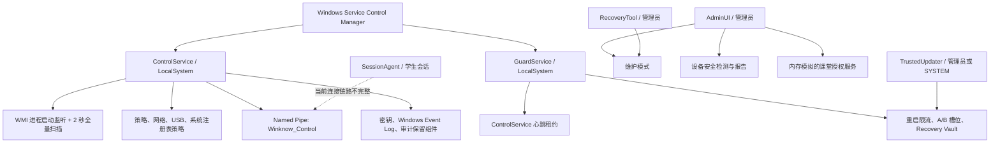
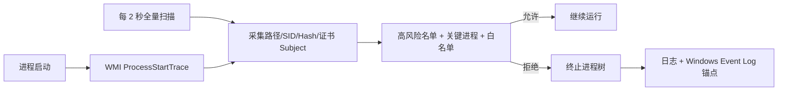
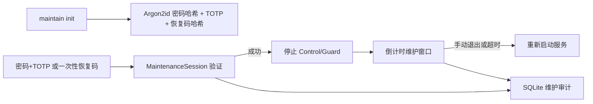
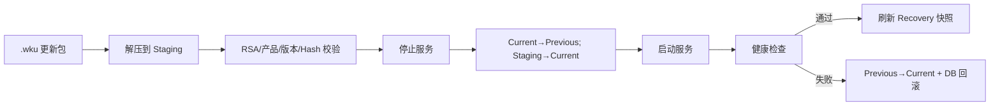
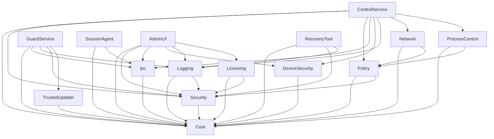

# Winknow V7.0 项目说明书（AI 分析交接版）

> 文档目的：向另一个 AI、代码审查人员或接手开发人员完整说明当前项目的产品定位、实际功能、技术栈、代码结构、实现方式、依赖、环境、运行链路和已知缺口。
>
> 事实基线：`develop` 分支，提交 `8ab40acae2832518a5cb68ca14e6cf9fa3aa7b55`，检查日期 2026-09-02。
>
> 重要原则：本文以当前源代码的实际行为为准，不把 `docs/` 中的产品需求、周计划或“完成报告”自动视为已落地能力。

## 1. 项目概述

Winknow V7.0 是一个面向 Windows 10/11 编程教室的本地终端管控系统。设计目标是让学生使用标准 Windows 用户账号进行编程学习，同时限制未授权程序、脚本解释器、代理/VPN、外部存储和部分系统管理入口；并向管理员提供维护、设备启动安全核验、更新回滚和课堂设备状态管理能力。

项目采用多进程、分层类库架构，核心进程包括两个 Windows 服务、一个学生会话代理、一个 WPF 管理控制台以及两个命令行维护工具。

当前代码具有较完整的模块骨架和大量单元测试，但仍包含模拟授权、未接通的 IPC/SessionAgent、未形成真实网站阻断链路、安装包漏件与安全验证占位等问题。因此，它更适合作为“功能较丰富的工程原型/预发布版本”，不能按当前状态直接认定为生产可用的强安全管控产品。

## 2. 功能状态标记

本文使用以下标记，帮助分析者区分“代码存在”和“功能实际有效”：

| 标记 | 含义 |
|---|---|
| **A－已接入** | 已有实现，并由主运行进程实际创建或调用 |
| **B－未接入** | 类或函数已经实现，但没有接入主要运行链路 |
| **C－部分/模拟** | 能演示部分流程，但关键安全或业务逻辑是占位、内存模拟或存在阻断缺陷 |
| **D－仅规划** | 需求或架构文档提到，但当前代码没有可工作的实现 |

## 3. 使用角色、部署边界与信任模型

### 3.1 使用角色

| 角色 | 预期权限 | 使用组件 | 主要操作 |
|---|---|---|---|
| 学生 | Windows 标准用户 | SessionAgent、被管控的 IDE/浏览器 | 编程、浏览允许站点、接收锁屏命令 |
| 机房管理员/教师 | 本地管理员，需 UAC | AdminUI、RecoveryTool | 维护授权、设备安全核验、查看课堂状态、锁定/解锁 |
| 系统服务账号 | LocalSystem | ControlService、GuardService | 进程枚举与终止、注册表/服务保护、策略执行、守护恢复 |
| 发布管理员 | 受控构建或运维环境 | TrustedUpdater、签名脚本 | 构建、签名、更新、回滚 |

### 3.2 支持范围

- Windows 10 Pro 22H2+ 或 Windows 11 Pro。
- x64、UEFI 环境；设备安全模块可检测 Secure Boot，并将部分 BIOS 项目交给人工核验。
- 目标课堂为 Windows 本地终端。当前没有真正的云端后台、教师 Web 控制台或集中数据库。
- 当前不使用 BitLocker，不能防御攻击者离线读取或修改未加密磁盘。
- 当前不包含内核驱动、WFP 驱动或完整的应用控制平台，安全边界主要建立在 LocalSystem 服务、WMI、注册表策略、文件/服务 ACL 和用户权限分离之上。

### 3.3 关键现实边界

- 本地管理员和 SYSTEM 原则上可以绕过用户态管控，项目不能承诺对这些权限“绝对不可停止”。
- `ClassroomPage` 展示的是进程内测试设备集合，不是通过局域网采集的真实多机状态。
- 网站白名单类能够判断域名，但主服务没有把判断接入代理、WFP、浏览器请求拦截或防火墙，因此当前不构成真实网站白名单阻断。
- SessionAgent 没有被主服务启动，也没有真正的 Win32/WPF 消息循环或键盘钩子。

## 4. 总体架构



### 4.1 可执行组件

| 组件 | 项目类型 | 预期身份 | 入口 | 实际职责与状态 |
|---|---|---|---|---|
| Winknow.ControlService | .NET Worker Windows Service | LocalSystem | `Program.cs` + `Worker.cs` | **A/C** 核心管控入口；接入进程、网络辅助、USB、自保护、IPC、心跳等，但多处链路不完整 |
| Winknow.GuardService | .NET Worker Windows Service | LocalSystem | `Program.cs` + `Worker.cs` | **A/C** 通过心跳监视主服务，带退避、限流、降级与恢复；受服务名和对端签名校验问题影响 |
| Winknow.SessionAgent | WinExe | 学生用户 | `Program.cs` | **C** 可连接 IPC、发送心跳和显示锁屏遮罩；未被拉起、会话 ID 错误、无消息循环/键盘钩子 |
| Winknow.AdminUI | WPF WinExe | 管理员 | `App.xaml` / `MainWindow.xaml` | **A/C** 维护入口、设备安全页、课堂总览；课堂数据为内存测试数据 |
| Winknow.TrustedUpdater | Console Exe | 管理员或 SYSTEM | `Program.cs` | **A/C** `apply/rollback/status/sign`，实现包验签、A/B 切换、健康检查、回滚；部分健康检查硬编码成功 |
| Winknow.RecoveryTool | Console Exe | 管理员/PE | `Program.cs` | **A/C** 维护初始化、进入维护、状态、卸载；“紧急恢复”并未形成独立命令，卸载鉴权不足 |

### 4.2 类库组件

| 类库 | 主要职责 |
|---|---|
| Winknow.Core | 常量、设备 ID、哈希/随机数、统一 `Result`、退避/重启限流/降级状态 |
| Winknow.Policy | JSON/Base64 策略模型、加载与基本版本校验 |
| Winknow.ProcessControl | WMI 进程事件、周期扫描、进程信息采集、白名单判断、终止 |
| Winknow.Network | 域名白名单判断、Hosts/PAC/代理/DNS/浏览器策略/VPN 检测/站点健康 |
| Winknow.DeviceSecurity | 固件与 Secure Boot 检测、USB 存储控制、BIOS 人工核验、评分和报告 |
| Winknow.Ipc | Named Pipe 协议、客户端/服务端、消息序列化、身份与防重放、心跳租约 |
| Winknow.Security | DPAPI、密码/TOTP/恢复码、文件/注册表/服务/进程保护、维护会话、对端验证 |
| Winknow.Logging | SQLite 维护审计、AES-GCM、哈希链、HMAC 检查点、事件日志锚点、保留策略 |
| Winknow.Licensing | LAN/Cloud 授权接口、离线宽限、锁定状态和课堂授权模拟 |
| Winknow.TrustedUpdater | 更新包、RSA 验签、版本守卫、A/B 槽位、恢复库、数据库迁移和编排 |

## 5. 全部功能说明与当前实现状态

### 5.1 核心服务启动与自保护

状态：**A/C**。

ControlService 启动后按以下顺序工作：

1. 创建全局 Mutex `Global\Winknow_ControlService_Instance`，并写入 owner 信息，阻止双实例。
2. 对当前进程应用 DACL，尝试降低标准用户获得终止权限的能力。
3. 对主服务应用服务 DACL、SCM Failure Actions，并注册 SafeBoot Minimal/Network 启动项。
4. 从 `AppContext.BaseDirectory\policies\default_policy_v7.0.json` 加载策略；找不到时退回内置默认软件白名单。
5. 加固主服务、守护服务和相关注册表项。
6. 在“当前用户”注册表范围禁用任务管理器、注册表编辑器和命令提示符，并检查 Run 项。
7. 初始化设备日志密钥、AES-GCM、哈希链、HMAC 检查点、Windows Event Log 锚点和 30 天清理器。
8. 启动进程实时监听、2 秒周期扫描、IPC 服务、网络辅助组件、USB 策略和心跳租约。

主要问题：

- 安装器内部服务名是 `WinknowControl` / `WinknowGuard`，代码多处将显示名 `Winknow Control Service` / `Winknow Guard Service` 传给 `OpenService`、`ServiceController` 或注册表路径，可能导致保护、停止、启动和恢复失败。
- 服务以 LocalSystem 运行时，`Registry.CurrentUser` 指向系统账号而非学生账号；当前禁用任务管理器/CMD/代理的 HKCU 操作不会自动覆盖所有学生用户配置单元。
- 自保护函数多采用“失败仅记录日志并继续”，不能把日志中的“已应用”直接视为成功。

### 5.2 软件与进程管控

状态：**A/C**。

已接入能力：

- `WmiProcessMonitor` 监听 `Win32_ProcessStartTrace`，新进程出现时立即收集并判断。
- `ProcessScanner` 启动时全量扫描，之后每 2 秒扫描一次，作为 WMI 丢事件或断连后的兜底。
- `ProcessInfoCollector` 收集 PID、进程名、可执行文件路径、SID/用户名、SHA-256 和证书 Subject。
- `ProcessJudge` 按高风险解释器、系统关键进程、路径规则、发布者规则和白名单作出允许/拒绝结果。
- `ProcessTerminator` 对被拒绝进程调用 `Process.Kill(entireProcessTree: true)`；它拒绝终止名称以 `Winknow.` 开头的自身组件。
- `WatcherReconnectPolicy` 为 WMI 监听重连提供退避与持续失败判断。

默认软件策略：

- 发布者允许 `Microsoft Corporation`、`Microsoft`。
- 路径允许 Visual Studio、VS Code、Dev-C++、Chrome、Edge。
- 学生输出目录声明为 `C:\Users\*\source\repos\**`、`C:\Dev-Cpp\Projects\**`，最大有效期 2 小时，单文件 50 MB。
- 高风险程序包括 `powershell.exe`、`wscript.exe`、`cscript.exe`、`mshta.exe`、`regedit.exe`、`mmc.exe`。

关键缺口：

- “关键系统进程”主要按进程名直接放行，恶意文件如果改名为 `svchost.exe`、`explorer.exe` 或 Winknow 组件名，可能绕过后续判断。
- 空文件路径分支可能在后续解引用空的匹配规则，引发异常。
- 证书发布者只通过 `X509Certificate2(filePath)` 读取 Subject，不等于完成 Authenticode 完整性、链信任和发布者固定校验。
- 策略里的 `ByHash`、学生输出最大时效和最大文件大小没有完整进入实际 Judge 决策。
- 路径通配规则较宽，路径可写性、重解析点、用户可替换文件等边界需要进一步验证。

### 5.3 网络管控与防绕过

状态：**B/C**；多个类已实现，只有部分由主服务启动，尚无完整“请求阻断”闭环。

模块能力：

- `WebsiteFilter`：加载域名白名单，支持精确域名和 `*.` 子域名匹配，也能从 URL 提取 Host 判断。
- `HostsProtector`：备份、监视和恢复 hosts 文件；可向 hosts 写入条目，但其自身明确说明网站白名单阻断应由其他机制完成。
- `ProxyGuard`：每 20 秒读取代理设置，判断 `ProxyEnable`、`ProxyServer`、`AutoConfigURL` 是否偏离策略并尝试恢复。
- `PacProtector`：读取 PAC、保存基线 SHA-256、监控文件变化并恢复。
- `DnsMonitor`：枚举网卡 DNS，检查允许/禁止列表。
- `BrowserPolicyEnforcer`：向 Chrome/Edge 企业策略注册表写入代理模式和 DoH/Secure DNS 禁用项。
- `VpnTunDetector`：按进程、服务和虚拟网卡名称检测 VPN/TUN/TAP。
- `WebsiteHealthChecker`：按间隔对配置的 HTTP 端点执行可达性和状态码检查。
- `NetworkFailMode`：解析 `strict` / `lenient`，并提供 IPv4/IPv6 一致性辅助判断。

主服务实际接入：域名规则加载、hosts 监控、代理守卫、一次 DNS 检查、浏览器策略写入、启动时一次 VPN 检测、周期网站健康检查。

关键缺口：

- 主服务从未调用 `WebsiteFilter.IsAllowed` / `IsUrlAllowed` 处理真实流量。
- 没有 WFP、Windows Firewall 规则、受控代理或浏览器扩展，所以不能真正只允许白名单站点。
- VPN 只检测并记录启动日志，没有终止、禁用或隔离动作。
- DNS 主要是检查，不是持续强制恢复；DoH 的阻断依赖浏览器策略，覆盖范围有限。
- `ProxyGuard` 从 LocalSystem 读取 `Registry.CurrentUser`，不是各学生会话的 HKCU。
- `NetworkFailMode` 只是帮助类，未形成贯穿网络链路的 fail-open/fail-closed 状态机。

### 5.4 USB 与设备启动安全

状态：**A/B**。

USB 运行时管控：

- `UsbStorageController` 通过 `HKLM\SYSTEM\CurrentControlSet\Services\USBSTOR\Start` 在启用与禁用之间切换。
- 默认策略禁止 Mass Storage，但保留键盘、鼠标等 HID。
- `UsbDeviceClassifier` 按 USB Class Code 区分存储、HID、网络、音视频、打印等设备，并只把 Mass Storage 作为默认阻断对象。

设备安全评估：

- `FirmwareInfoCollector` 用 WMI/Win32 API 读取 BIOS 厂商、型号、版本、系统厂商和 UEFI/Legacy 类型，并生成设备指纹。
- `SecureBootDetector` 读取 Secure Boot 状态，并区分启用、禁用、不支持、未知和错误。
- `BootConfigCollector` 收集启动/分区信息。
- `BiosCompatibilityMatrix` 为 Dell、HP、Lenovo、ASUS、Acer 和通用设备提供 BIOS 菜单路径提示。
- `ManualChecklist` 保存 BIOS 管理员密码、USB Boot、PXE、Boot Order、Boot Menu 等人工核验结论。
- `DeviceSecurityScorer` 按检查项权重计算 0－100 分和等级，并生成整改建议。
- `VerificationStore` 保存固件指纹和核验记录，固件变化或记录过期时要求重新核验。
- `ReportExporter` 可导出 Markdown 和 CSV 报告。

AdminUI 的“设备安全”页已经接入检测、评分、人工通过/失败记录以及 MD/CSV 导出。它不能通用地自动修改各品牌 BIOS；无法读取的项目必须人工核验。

### 5.5 IPC 与心跳协议

状态：**C**。

通信使用 Named Pipe，默认管道名为 `Winknow_Control`。消息模型包含：

- 协议版本；
- `RequestId`；
- UTC 时间戳；
- 16 字节 Nonce；
- 发送者 SID；
- 16 位消息类型；
- Payload 长度和 Payload。

`IpcAuthenticator` 设计了以下校验：

- 协议版本一致；
- 时间戳在允许窗口内；
- 请求 ID 对同一 SID 单调递增；
- Nonce 在缓存期限内不重复；
- SID 位于允许列表；
- 可选 DeviceId 一致性。

`IpcClient` 支持连接、发送消息、等待响应和发送心跳；`IpcServer` 支持多连接接受、读消息、认证、触发 `MessageReceived` 事件和返回响应。

当前问题：

- Pipe ACL 给 `Everyone` 读写，安全性完全依赖应用层认证。
- 服务端没有从 Pipe 连接令牌获得真实客户端 SID，而是信任消息中的自报 `SenderSid`。
- ControlService 默认认证器只允许 SYSTEM 和管理员，真实学生 SessionAgent 的 SID 会被拒绝。
- ControlService 的 `OnMessageReceived` 只写 Debug 日志，不执行锁屏、策略下发或会话管理。
- 断线重连后同一 SID 的请求 ID 状态可能使从 1 重新计数的客户端被当作重放。

### 5.6 SessionAgent 与锁屏

状态：**C/D**。

已存在代码：

- 尝试按会话创建全局 Mutex，保证每个会话一个 Agent。
- 读取当前用户 SID，连接主服务 Named Pipe。
- 每 30 秒发送 IPC 心跳。
- 收到硬编码消息类型 `1001` 后，根据 `SHOW` / `HIDE` 调用 `LockOverlay`。
- `LockOverlay` 使用 Win32 创建全屏、置顶、无边框窗口，绘制锁定提示，覆盖多显示器并尝试限制关闭。

未完成或错误：

- `GetCurrentSessionId()` 返回的是 `Environment.ProcessId`，不是 Windows Session ID，互斥语义错误。
- ControlService 没有 WTS 登录事件监听，也没有 `CreateProcessAsUser` 拉起 Agent 的实现。
- 安装发布脚本不发布 SessionAgent。
- 没有 Win32/WPF 消息循环，当前用无限 `Task.Delay` 等待；锁屏窗口不一定能正常泵送消息。
- 代码注释提到键盘钩子，但没有实现；Ctrl+Shift+Esc、Win+R、Alt+Tab 等键盘策略没有落地。
- 事件退订使用了一个新 lambda，不能移除原订阅。

### 5.7 授权、离线宽限和课堂总览

状态：**C－模拟实现**。

代码模型包含：

- `ILicenseProvider`：验证设备、判断授权、生成动态码的抽象接口。
- `LanProvider`：预期向教师机局域网端点请求令牌。
- `CloudProvider`：云端接口占位。
- `DeviceLicenseClient`：定时刷新令牌、生成动态码、缓存离线令牌。
- `OfflineGraceStore`：用 DPAPI LocalMachine 保护离线令牌并判断宽限期。
- `LicenseEnforcement`：判断 Active/GracePeriod/Locked，校验动态码或固定码并解锁。
- `TeacherLicenseServer`：维护设备名单，签发令牌，锁定、解锁、生成动态码。
- AdminUI `ClassroomPage`：显示在线、宽限、锁定数量和设备列表，生成解锁码、锁定、解锁。

实际限制：

- `TeacherLicenseServer` 启动时写入测试设备，所有数据只在当前 AdminUI 进程内存中。
- `LanProvider` 用延时模拟网络请求，默认把设备视为已授权，并生成模拟签名。
- `CloudProvider` 是未实现占位。
- `LicenseToken.VerifySignature` 仅检查签名字段非空，没有公钥验签。
- `TeacherLicenseServer` 和客户端的令牌签名不是生产数字签名。
- 固定解锁码接受任意长度不少于 8 的字符串。
- 动态码密钥只从公开的 DeviceId 派生，攻击者可复现。
- AdminUI 锁定仅改变内存状态；向 SessionAgent 发送锁屏命令仍是 TODO。
- Licensing 没有接入 ControlService，因此授权失效不会关闭核心管控或驱动真实锁屏。

结论：该模块当前用于 UI/业务流程演示，不能视为真实授权系统或课堂多机控制系统。

### 5.8 维护模式与双因子验证

状态：**A/C**。

维护初始化由 RecoveryTool 完成：

```text
RecoveryTool maintain init
```

初始化流程：

1. 要求输入两次不少于 8 位的维护密码。
2. 使用 Argon2id 生成带盐哈希。
3. 随机生成 20 字节 TOTP Secret，并输出 Base32 和 `otpauth://` URI。
4. 生成 10 个一次性恢复码；磁盘只保存 SHA-256 哈希和使用状态。
5. 在 `%ProgramData%\Winknow\maintain` 下保存配置和维护审计数据库。

进入维护支持两条路径：

- 密码 + 6 位 TOTP；
- 一次性恢复码。

`MaintenanceSession` 负责验证、有效期、延长、手动退出、超时退出和审计回调。RecoveryTool 的命令行维护会在进入时停止服务，在退出/超时时重新启动服务。

AdminUI 提供相同的维护输入和倒计时界面，但存在一个重要缺陷：其 `OnExit` 只更新界面，没有调用 `StartManagedServices`。因此 UI 显示“服务保护已自动恢复”时，服务实际上可能仍然停止。停止服务异常也被吞掉，维护会话可能在管控未真正停用时仍返回成功。

维护配置中的 TOTP Secret 以 Base32 明文保存在 `maintain.json`，没有通过 DPAPI 单独保护。

### 5.9 恢复工具与卸载

状态：**A/C**。

RecoveryTool 当前命令：

| 命令 | 功能 |
|---|---|
| `maintain init` | 初始化维护密码、TOTP、恢复码 |
| `maintain enter [options]` | 进入定时维护；支持密码+TOTP或恢复码 |
| `maintain status` / `status` | 查询最近维护审计记录 |
| `uninstall [--yes]` | 停止/删除服务，删除维护和策略目录 |
| `help` | 显示帮助 |

关键缺口：

- 文件头注释说支持“策略/服务/日志紧急恢复”，但命令分发没有独立 repair/restore 命令。
- `uninstall` 只要求文本确认或 `--yes`，没有验证维护密码、TOTP 或一次性恢复码。
- 卸载过程中先删除维护目录和审计库，再尝试向同一数据库写 `uninstall` 审计，流程不可靠。
- Inno Setup 卸载也只有 Yes/No 提示，不执行真正的维护授权验证。

### 5.10 日志、完整性和隐私

状态：**A/B/C**。

已实现的基础组件：

- `MaintenanceAuditLog`：SQLite 表 `maintenance_audit`，记录 actor、operation、reason、detail、timestamp。
- `LogCipher`：AES-256-GCM；格式为 Base64(nonce + ciphertext + tag)。
- `HashChain`：每条记录 Hash 包含上一条 Hash，可检测中间记录被改动。
- `LogCheckpointSigner`：用 HMAC-SHA256 对链尾和记录数创建/验证检查点。
- `EventLogAnchor`：将安全、维护、更新关键事件写入 Windows Event Log。
- `DeviceLogKeyGenerator`：每机生成日志加密密钥和检查点密钥，并用 DPAPI LocalMachine 保存。
- `DataRetentionManager`：默认删除 30 天前的维护审计、执行 SQLite `VACUUM`，并提供文件覆盖删除。
- `PrivacyPolicy`：维护允许字段、默认收集字段和默认排除字段清单。

当前主服务只初始化这些对象，并把部分安全事件写入 Event Log；没有一个完整的“业务事件 → 字段过滤 → AES 加密 → SQLite 追加 → 哈希链 → 每 100 条检查点”的持久化管道。换言之，各加密/完整性类存在且有测试，但端到端审计日志系统尚未真正接通。

隐私设计声明默认不记录网页正文、学生源代码、表单内容、密码和完整 HTTPS 内容；域名、进程名、路径、发布者、哈希、时间、策略版本和处理结果属于预期收集范围。

### 5.11 GuardService 守护与自动修复

状态：**A/C**。

ControlService 每 5 秒将 PID、服务名、版本、启动时间和心跳时间写入 `%ProgramData%\Winknow\control_heartbeat.json`。GuardService 每 5 秒检查一次；15 秒未更新视为服务死亡或僵死。

守护流程：

1. 如果 `update_mode.flag` 在 10 分钟新鲜期内，暂停干预，避免更新器停服务时被重新拉起。
2. 心跳正常时清零指数退避；限流窗口冷却后尝试退出 Safe Degraded Mode。
3. 心跳异常时先检查是否已处于降级模式。
4. 10 分钟内达到最多 5 次重启限制后进入降级，每 60 秒尝试恢复。
5. 拉起前通过 `PeerVerifier` 检查路径、签名、版本和 Recovery manifest 的 SHA-256。
6. 对端不可信时不拉起，转而尝试 Recovery/Previous 修复。
7. 对端可信时启动、继续或重启 ControlService，失败采用 1－60 秒指数退避。

关键缺口：

- `PeerVerifier` 使用证书读取 API，未使用 `WinVerifyTrust` 完整验证 Authenticode、证书链和撤销状态，也未默认固定生产发布者。
- GuardService 查找的服务名与安装器内部服务名不一致。
- “Safe Degraded 保持最低管控”主要是状态和日志描述；Guard 本身没有实现进程/网络拦截，主服务停止后最低管控能力有限。
- Recovery Vault 缺少可信清单时，某些自动修复路径可能把当前文件建立为初始快照，削弱信任来源。

### 5.12 可信更新、A/B 部署与回滚

状态：**A/C**。

TrustedUpdater 命令：

| 命令 | 功能 |
|---|---|
| `apply <package.wku> [--publickey <path>]` | 应用更新包 |
| `rollback` | 将 Previous 切回 Current |
| `status` | 显示当前版本和是否可回滚 |
| `sign ...` | 开发环境为 manifest 生成签名 |

更新包流程：

1. 写入更新模式标志，拒绝并发更新。
2. 解压到 Staging。
3. 读取 `manifest.json`。
4. RSA 公钥验证 manifest 签名，校验 ProductId、目标版本、最低可升级版本和文件 SHA-256。
5. 可选执行数据库备份/迁移。
6. 停止受管服务。
7. 目录切换：Current → Previous，Staging → Current，并写 `version.json`。
8. 启动服务并执行健康检查。
9. 健康失败时回滚 Previous，并恢复数据库。
10. 成功后刷新 Recovery Vault 快照并退出更新模式。

更新槽位位于 `%ProgramData%\Winknow\deploy`：`Current`、`Previous`、`Staging`、`Recovery`。

关键缺口：

- `CheckAgentHealth` 和 `CheckPolicyHealth` 在命令入口中硬编码成功。
- 停服务过程吞掉异常，可能在旧服务仍运行时进行目录切换。
- 包先解压后验签，缺少压缩炸弹、文件数量、总大小和路径边界的严格限制。
- Hash 校验只验证 manifest 列出的文件，不拒绝包内额外未列出的文件。
- 安装器调用 `TrustedUpdater snapshot`，但程序没有 `snapshot` 命令。

### 5.13 管理控制台

状态：**A/C**。

WPF 管理控制台有三个页签：

1. **维护模式**：输入维护密码+TOTP或恢复码，设置超时分钟数，进入/退出并显示倒计时。
2. **设备安全**：运行设备检测、展示总分/等级/Secure Boot/固件信息和检查项，人工标记核验结论，导出 MD/CSV。
3. **课堂总览**：显示测试设备的在线/宽限/锁定状态，刷新、生成动态码、锁定和解锁。

控制台没有策略编辑器、真实远程策略下发、日志查询/导出页、软件白名单管理页、云端登录或真实局域网设备发现。

### 5.14 安装、构建、签名与灰度

状态：**C**。

`installer/Build-Release.ps1` 执行：

1. Release 构建解决方案。
2. Publish ControlService、GuardService、TrustedUpdater、AdminUI。
3. 可选使用 Obfuscar 混淆指定 DLL。
4. 复制默认策略。
5. 可选调用 `Sign-Release.ps1` 做 Authenticode 签名。
6. 生成含 path、SHA-256、size 的 `release_manifest.json`。

`WinknowSetup.iss` 预期使用 Inno Setup 6 创建 x64 安装包、检测 .NET 8 Desktop Runtime、复制 A/B 当前槽、用 `sc.exe` 创建两个 LocalSystem 自动服务并配置失败恢复。

已确认的安装链问题：

- Build-Release 不发布 SessionAgent、RecoveryTool 和 Licensing；发布产物中缺少这些运行所需文件。
- 策略被复制到 payload 的 `policy`，安装为 `%ProgramData%\Winknow\policy.json`，而 ControlService 查找自身目录下的 `policies\default_policy_v7.0.json`。
- 安装脚本调用不存在的 `snapshot` 命令。
- 安装器内部服务名与代码使用的显示名不一致。
- `[Services]` 段和 `UsingServices` 声明需用实际 Inno Setup 6 编译器复核；当前机器未安装 ISCC，尚未证明脚本可编译。

`canary/` 提供三阶段灰度计划、准备度检查、发布产物检查、步骤执行、指标采集、人工清单和报告模板。这些脚本属于发布治理工具，不等于实际完成了稳定的生产灰度。

## 6. 关键实现流程

### 6.1 进程管控流程



### 6.2 维护流程



注：上述“重新启动服务”在 RecoveryTool 路径中存在，在 AdminUI 路径中当前没有正确调用。

### 6.3 更新流程



## 7. 技术栈

| 类别 | 技术/工具 | 用途 |
|---|---|---|
| 语言 | C#，`LangVersion=latest` | 全部应用和类库 |
| 平台 | .NET 8，`net8.0-windows` | Windows 专用桌面/服务应用 |
| 服务框架 | Generic Host、Worker Service、WindowsServices | ControlService、GuardService |
| 桌面 UI | WPF/XAML | AdminUI |
| Windows API | WMI/System.Management、Registry、ServiceController、P/Invoke | 进程、BIOS、USB、服务、ACL、SafeBoot |
| IPC | `NamedPipeServerStream` / `NamedPipeClientStream` | 服务与会话代理通信 |
| 数据库 | SQLite + Microsoft.Data.Sqlite + Dapper | 维护审计、保留清理 |
| 密码 | Argon2id | 维护密码哈希 |
| 本地密钥保护 | Windows DPAPI LocalMachine | 日志密钥、离线令牌 |
| 加密与完整性 | AES-256-GCM、SHA-256、HMAC-SHA256、RSA | 日志正文、哈希链、检查点、更新包 |
| 测试 | xUnit、Moq、Microsoft.NET.Test.Sdk、coverlet | 单元测试和覆盖率采集 |
| CI | GitHub Actions `windows-latest` | restore、Release build、test |
| 安装 | Inno Setup 6、PowerShell、`sc.exe` | 安装包和服务注册 |
| 混淆 | Obfuscar Global Tool | 发布 DLL 混淆 |
| 签名 | SignTool/PowerShell 签名流程 | 发布二进制 Authenticode |

全局编译规则：Nullable 开启、ImplicitUsings 开启、TreatWarningsAsErrors 开启、生成 XML 文档。

## 8. NuGet 依赖

依赖版本由根目录 `Directory.Packages.props` 集中管理。

### 8.1 生产依赖

| 包 | 版本 | 使用目的 |
|---|---:|---|
| Microsoft.Extensions.Hosting | 8.0.0 | Generic Host / Worker |
| Microsoft.Extensions.Hosting.WindowsServices | 8.0.0 | Windows Service 集成 |
| Microsoft.Extensions.Logging.Abstractions | 8.0.0 | 类库日志抽象 |
| Microsoft.Extensions.Logging.Console | 8.0.0 | AdminUI/SessionAgent 控制台 Logger Provider |
| System.Management | 8.0.0 | WMI 进程、固件、网络适配器检测 |
| System.ServiceProcess.ServiceController | 8.0.0 | 启停和查询 Windows 服务 |
| Microsoft.Data.Sqlite | 9.0.0 | SQLite 数据访问 |
| Dapper | 2.1.35 | SQLite 轻量 ORM/SQL 映射 |
| Konscious.Security.Cryptography.Argon2 | 1.3.1 | Argon2id 密码哈希 |
| System.Security.Cryptography.ProtectedData | 8.0.0 | DPAPI |

### 8.2 测试依赖

| 包 | 版本 |
|---|---:|
| xunit | 2.9.2 |
| xunit.runner.visualstudio | 2.8.2 |
| Moq | 4.20.72 |
| Microsoft.NET.Test.Sdk | 17.11.1 |
| coverlet.collector | 6.0.2 |

### 8.3 重要传递依赖与已知漏洞

实际还会解析 `SQLitePCLRaw.* 2.1.10`、`System.Text.Json 8.0.0`、`System.Diagnostics.EventLog 8.0.0`、`System.CodeDom 8.0.0` 等传递依赖。

在 2026-09-02 的本地 `dotnet list package --vulnerable --include-transitive` 检查中，发现：

- `SQLitePCLRaw.lib.e_sqlite3 2.1.10`：High；
- `System.Text.Json 8.0.0`：High。

交给另一个 AI 分析时，应要求它重新联网核对当前公告、受影响版本和安全升级路径，不应只依据本文日期的结果。

## 9. 解决方案与项目依赖关系

解决方案 `WinknowV7.sln` 包含 15 个生产项目和 10 个测试项目。



值得注意：`ControlService` 没有引用 `Winknow.Licensing`，说明授权状态没有接入核心管控决策。

## 10. 仓库文件结构

### 10.1 顶层结构

```text
winknow/
├─ .github/workflows/ci.yml          GitHub Actions Windows CI
├─ canary/                           灰度计划、核验脚本、采集脚本和报告模板
├─ docs/                             PRD、架构、威胁模型、开发计划和交付文档
├─ installer/                        Release 组装、签名、混淆和 Inno Setup
├─ policies/default_policy_v7.0.json 默认课堂策略
├─ src/                              15 个生产项目
├─ tests/UnitTests/                  10 个 xUnit 测试项目
├─ tools/                            预留工具目录
├─ Directory.Build.props            全局编译设置
├─ Directory.Packages.props         中央包版本管理
├─ global.json                      .NET SDK 8.0.400
├─ README.md                         简要说明
└─ WinknowV7.sln                    解决方案
```

### 10.2 源代码文件职责索引

#### Winknow.Core

- `Constants.cs`：产品版本、注册表、IPC、日志、守护和设备安全常量。
- `DeviceId.cs`：从机器信息生成稳定设备 ID。
- `SecurityUtils.cs`：SHA-256、文件哈希、安全随机字节和 Nonce。
- `Results/Result.cs`：泛型/非泛型结果与统一 ErrorCode。
- `Guarding/ExponentialBackoff.cs`：指数退避。
- `Guarding/RestartThrottle.cs`：滑动窗口重启限流。
- `Guarding/SafeDegradedMode.cs`：安全降级状态及原因。

#### Winknow.ControlService

- `Program.cs`：注册 Windows Service 和 Worker。
- `Worker.cs`：主服务全部启动、管控、网络、日志、IPC、扫描、心跳和清理编排。
- `appsettings.json`：Microsoft Logging 等级。

#### Winknow.GuardService

- `Program.cs`：注册守护 Windows Service。
- `Worker.cs`：心跳检查、对端验证、重启、退避、限流、降级和恢复。
- `appsettings.json`：日志配置。

#### Winknow.SessionAgent

- `Program.cs`：会话单实例、IPC 连接、心跳、消息分发。
- `SessionMutex.cs`：按会话命名的 Mutex。
- `LockOverlay.cs`：Win32 全屏锁定遮罩。

#### Winknow.AdminUI

- `App.xaml(.cs)`：WPF 应用入口。
- `MainWindow.xaml(.cs)`：三页签外壳和维护模式。
- `MaintenanceEntryDialog.xaml(.cs)`：密码/TOTP/恢复码表单。
- `DeviceSecurityPage.xaml(.cs)`：检测、评分、人工核验、报告导出。
- `ClassroomPage.xaml(.cs)`：测试设备列表、动态码、锁定/解锁。

#### Winknow.Policy

- `PolicyFile.cs`：软件、网络、USB 的完整策略数据模型和 Base64 编解码。
- `PolicyLoader.cs`：JSON 加载、基本字段和 7.x 版本校验；签名校验仍为 TODO。

#### Winknow.ProcessControl

- `ProcessInfo.cs`：进程信息 DTO。
- `ProcessInfoCollector.cs`：路径、SID、用户名、Hash、证书 Subject 采集。
- `WhitelistRuleSet.cs`：从策略创建路径/发布者规则并匹配。
- `ProcessJudge.cs`：允许/阻止决策。
- `ProcessTerminator.cs`：结束进程树并保护自身组件。
- `WmiProcessMonitor.cs`：实时进程启动事件。
- `ProcessScanner.cs`：启动与周期全量扫描。
- `WatcherReconnectPolicy.cs`：WMI 断线重连退避。

#### Winknow.Network

- `WebsiteFilter.cs`：域名/URL 白名单判断。
- `HostsProtector.cs`：hosts 备份、恢复和变化监控。
- `ProxyGuard.cs`：系统代理偏差检查和恢复。
- `PacProtector.cs`：PAC 完整性基线、监控和恢复。
- `DnsMonitor.cs`：网卡 DNS 枚举及允许/禁止检查。
- `BrowserPolicyEnforcer.cs`：Chrome/Edge 代理和 DoH 企业策略。
- `VpnTunDetector.cs`：VPN 进程、服务、虚拟网卡检测。
- `WebsiteHealthChecker.cs`：站点 HTTP 健康探测。
- `NetworkFailMode.cs`：严格/宽松失败模式和双栈辅助规则。

#### Winknow.DeviceSecurity

- `Models.cs`：固件、检查项、报告、核验记录等模型和枚举。
- `FirmwareInfoCollector.cs`：WMI 固件/设备信息和指纹。
- `SecureBootDetector.cs`：Secure Boot 状态检测与评价。
- `BootConfigCollector.cs`：启动方式、磁盘与分区信息。
- `BiosCompatibilityMatrix.cs`：多品牌 BIOS 菜单指引。
- `ManualChecklist.cs`：人工核验项和持久化。
- `VerificationStore.cs`：核验记录、有效期和固件变化失效。
- `DeviceSecurityScorer.cs`：评分、等级和整改建议。
- `DeviceSecurityAssessor.cs`：聚合自动检测和人工记录。
- `ReportExporter.cs`：Markdown/CSV 输出。
- `UsbStorageController.cs`：USBSTOR 启用/禁用。
- `UsbDeviceClassifier.cs`：USB Class 分类。

#### Winknow.Ipc

- `IpcConstants.cs`：管道名、协议版本、大小和超时常量。
- `IpcMessage.cs`：消息创建、二进制序列化和反序列化。
- `IpcAuthenticator.cs`：SID、时间戳、RequestId、Nonce、防重放和 DeviceId 校验。
- `IpcServer.cs`：Named Pipe 服务端和连接处理。
- `IpcClient.cs`：Named Pipe 客户端、发送、接收和心跳。
- `HeartbeatLease.cs`：服务心跳文件写入、检查和清理。

#### Winknow.Security

- `MaintenancePassword.cs`：Argon2id 密码哈希与验证。
- `TotpGenerator.cs`：RFC 风格 TOTP 和 Base32 解码。
- `RecoveryCodeStore.cs`：一次性恢复码生成、哈希存储和消费。
- `MaintenanceSession.cs`：双因子/恢复码、超时、延长、退出和审计。
- `DpapiProtector.cs`：DPAPI LocalMachine 字节/文件保护。
- `DeviceLogKeyGenerator.cs`：日志密钥生成和持久化。
- `KeyManifest.cs`：密钥用途、来源、是否含私钥的声明模型。
- `FileAclProtector.cs`：文件和目录 ACL。
- `RegistryAclProtector.cs`：服务/产品注册表 ACL。
- `ServiceDaclProtector.cs`、`ServiceSecurity.cs`：服务 DACL 加固。
- `ServiceRecovery.cs`：SCM Failure Actions。
- `ProcessSecurity.cs`：进程对象 DACL。
- `SafeBootRegistrar.cs`：Minimal/Network SafeBoot 服务项。
- `PeerVerifier.cs`：路径、签名、版本和 Hash 对端校验。
- `PolicyEnforcer.cs`：任务管理器、注册表编辑器、CMD 和 Run 项策略。
- `SingleInstanceGuard.cs`：全局 Mutex 与 owner 文件。

#### Winknow.Logging

- `MaintenanceAuditLog.cs`：维护 SQLite 表和查询。
- `LogCipher.cs`：AES-256-GCM。
- `HashChain.cs`：SHA-256 链式完整性。
- `LogCheckpointSigner.cs`：HMAC 检查点。
- `EventLogAnchor.cs`：Windows Event Log 双写。
- `DataRetentionManager.cs`：30 天清理、VACUUM、覆盖删除和大小检查。
- `PrivacyPolicy.cs`：日志字段允许/排除策略。

#### Winknow.Licensing

- `ILicenseProvider.cs`：授权提供者接口。
- `LanProvider.cs`：局域网提供者模拟。
- `CloudProvider.cs`：云端占位。
- `LicenseToken.cs`：设备令牌模型。
- `OfflineGraceStore.cs`：DPAPI 离线宽限令牌。
- `DeviceLicenseClient.cs`：定时刷新和宽限处理。
- `LicenseEnforcementStatus.cs`：Active/Grace/Locked 状态。
- `LicenseEnforcement.cs`：状态判断和解锁校验。
- `TeacherLicenseServer.cs`：内存设备名单、令牌、动态码、锁定/解锁。

#### Winknow.TrustedUpdater

- `Program.cs`：apply、rollback、status、sign 命令。
- `UpdateManifest.cs`：产品、版本、文件、签名模型和可签名 JSON。
- `UpdatePackage.cs`：ZIP/WKU 解压、manifest 读取和文件 Hash。
- `PackageVerifier.cs`：RSA 签名、ProductId 和组合验证。
- `VersionGuard.cs`：版本比较、升级和兼容性限制。
- `DeploymentSlots.cs`：Current/Previous/Staging 切换。
- `RecoveryVault.cs`：Recovery 快照、manifest、校验和单文件恢复。
- `AutoRepairService.cs`：Current 检查、Recovery/Previous 修复策略。
- `HealthChecker.cs`：组合健康检查。
- `DatabaseMigrator.cs`：数据库备份、迁移和恢复回调。
- `UpdateModeFlag.cs`：更新/守护协调标志。
- `UpdateOrchestrator.cs`：完整更新和回滚编排。

#### Winknow.RecoveryTool

- `Program.cs`：维护初始化、进入、状态、服务启停和卸载命令。

### 10.3 测试结构

```text
tests/UnitTests/
├─ Winknow.Architecture.Tests
├─ Winknow.Core.Tests
├─ Winknow.DeviceSecurity.Tests
├─ Winknow.Guard.Tests
├─ Winknow.Ipc.Tests
├─ Winknow.Network.Tests
├─ Winknow.Policy.Tests
├─ Winknow.ProcessControl.Tests
├─ Winknow.Security.Tests
└─ Winknow.TrustedUpdater.Tests
```

没有独立的 Licensing、SessionAgent、AdminUI、ControlService、RecoveryTool 或安装器端到端测试项目。

## 11. 配置、服务名、注册表与数据路径

### 11.1 默认策略

策略文件：`policies/default_policy_v7.0.json`。

顶层字段：

- `Version`、`PolicyId`、`CreatedAt`、`Description`；
- `SoftwareControl`：发布者/路径/Hash 白名单、学生输出、高风险解释器；
- `NetworkControl`：网站、代理/PAC、DNS、浏览器、VPN、健康端点；
- `UsbControl`：Mass Storage 和 HID。

策略加载器只强制要求 Version、PolicyId 且 Version 以 `7.` 开头。`validateSignature=true` 时也只写警告，未验证签名。Base64 编码只用于降低可读性，不是加密或防篡改。

### 11.2 服务与 IPC 标识

| 项 | 当前值 |
|---|---|
| 主服务显示名/代码常量 | `Winknow Control Service` |
| 守护服务显示名/代码常量 | `Winknow Guard Service` |
| 安装器主服务内部名 | `WinknowControl` |
| 安装器守护服务内部名 | `WinknowGuard` |
| Named Pipe | `Winknow_Control` |
| ControlService Mutex | `Global\Winknow_ControlService_Instance` |
| SessionAgent Mutex | `Global\Winknow_SessionAgent_Session_{sessionId}` |

### 11.3 主要磁盘路径

| 路径 | 内容 |
|---|---|
| `%ProgramData%\Winknow\deploy\Current` | 当前服务版本 |
| `%ProgramData%\Winknow\deploy\Previous` | 上一版本 |
| `%ProgramData%\Winknow\deploy\Staging` | 更新暂存 |
| `%ProgramData%\Winknow\deploy\Recovery` | 可信恢复副本和 `manifest.json` |
| `%ProgramData%\Winknow\control_heartbeat.json` | 主服务心跳租约 |
| `%ProgramData%\Winknow\update_mode.flag` | 更新模式标志 |
| `%ProgramData%\Winknow\keys\log_enc.key` | DPAPI 保护的日志加密密钥 |
| `%ProgramData%\Winknow\keys\log_hmac.key` | DPAPI 保护的检查点密钥 |
| `%ProgramData%\Winknow\audit.db` | 主服务期望的审计库路径 |
| `%ProgramData%\Winknow\maintain\maintain.json` | 密码哈希和 TOTP Secret |
| `%ProgramData%\Winknow\maintain\recovery-codes.json` | 恢复码哈希与使用状态 |
| `%ProgramData%\Winknow\maintain\audit.db` | 维护审计库 |
| `%ProgramData%\Winknow\device_security\verification.json` | 设备核验记录 |
| `%ProgramData%\Winknow\device_security\checklist.json` | 人工检查项 |
| `%ProgramData%\Winknow\Licensing\offline_grace.dat` | DPAPI 离线授权令牌 |

注意：日志系统同时出现根目录 `audit.db` 和 `maintain\audit.db`，两者并非同一个数据库。

### 11.4 注册表范围

- `HKLM\SOFTWARE\Winknow`：产品策略/安全/日志规划根。
- `HKLM\SYSTEM\CurrentControlSet\Services\USBSTOR`：USB 存储开关。
- `HKLM\SOFTWARE\Policies\Google\Chrome`：Chrome 企业策略。
- `HKLM\SOFTWARE\Policies\Microsoft\Edge`：Edge 企业策略。
- `HKCU\Software\Microsoft\Windows\CurrentVersion\Policies\System`：任务管理器、注册表编辑器等用户策略。
- `HKCU\Software\Microsoft\Windows\CurrentVersion\Internet Settings`：代理设置。
- SafeBoot Minimal/Network 服务注册表项。

## 12. 开发、构建和运行环境

### 12.1 必需环境

- Windows 10/11 x64；部分项目只能在 Windows 上编译/运行。
- .NET SDK 8.0.400。`global.json` 使用 `rollForward: latestFeature`。
- Visual Studio 2022，建议安装“.NET 桌面开发”和 Windows SDK 工作负载。
- 目标机需要 .NET 8 Desktop Runtime x64；当前发布不是 self-contained。
- 安装包构建需要 Inno Setup 6 `ISCC.exe`。
- 默认发布混淆需要 Obfuscar Global Tool；脚本可自动尝试安装。
- 正式签名需要受控的代码签名证书/私钥，私钥不应进入客户端仓库或安装目录。
- 执行服务、注册表、USB、SafeBoot、ACL 和安装测试需要管理员权限；完整验证最好使用隔离的 Windows 虚拟机快照。

### 12.2 常用命令

```powershell
dotnet restore WinknowV7.sln
dotnet build WinknowV7.sln -c Release
dotnet test WinknowV7.sln -c Release --no-build
```

发布 payload：

```powershell
powershell -ExecutionPolicy Bypass -File installer\Build-Release.ps1 -SkipObfuscation
```

正式发布可增加 `-Sign` 和证书参数；之后用 Inno Setup 编译 `installer\WinknowSetup.iss`。

维护初始化示例：

```powershell
Winknow.RecoveryTool.exe maintain init
Winknow.RecoveryTool.exe maintain enter --password <pwd> --totp <code> --reason repair --timeout 15
```

更新示例：

```powershell
Winknow.TrustedUpdater.exe status
Winknow.TrustedUpdater.exe apply update.wku --publickey publickey.pem
Winknow.TrustedUpdater.exe rollback
```

### 12.3 本地验证结果

在检查机器上：

- 只安装了 .NET SDK 10.0.103；仓库根目录受 `global.json` 影响，无法解析要求的 8.0.400 SDK。
- 从仓库父目录调用 .NET 10 SDK、显式构建该 net8 解决方案时，Release 构建通过，0 warning、0 error。
- 10 个测试程序集里实际执行了 9 个，共 422 项通过。
- `Winknow.Network.Tests.dll` 被本机 Windows 应用控制策略阻止，执行 0 项；但 `dotnet test` 总进程仍返回 0。这意味着当前 CI/本地测试可能出现“测试程序集零执行但整体假绿”。
- 一次 `Build-Release.ps1 -SkipObfuscation` 组装成功并生成 193 文件 manifest，但 payload 缺少 SessionAgent、Licensing、RecoveryTool，且策略位置与服务期望不一致。

这些结果反映的是该检查环境，不应替代目标 Windows 10/11 虚拟机上的安装、服务和安全验证。

## 13. CI、测试和质量控制

`.github/workflows/ci.yml` 在 `develop` 和 `main` 的 push/PR 上运行：

1. Checkout；
2. 根据 `global.json` 安装 SDK；
3. `dotnet restore`；
4. Release build；
5. Release test。

测试覆盖主题包括：

- Core Result、哈希和退避组件；
- 策略加载和模型；
- 进程白名单、判断、WMI 重连；
- IPC 消息、防重放和管道组件；
- 网络代理、PAC、DNS、VPN、健康检测和浏览器策略；
- 维护密码、TOTP、恢复码、日志加密/哈希链/检查点；
- Guard 心跳、单实例、限流、对端校验和自动修复；
- TrustedUpdater manifest、包、版本、A/B 编排和数据库迁移；
- DeviceSecurity 固件、评分、USB 和报告逻辑。

质量缺口：

- CI 不检查每个测试 DLL 的执行数量，存在 0-test 假绿风险。
- 没有安装器编译、真实 Windows Service 安装、标准用户绕过、重启/登录/注销、UAC、升级/回滚和卸载端到端测试。
- 没有 Licensing、SessionAgent、AdminUI、RecoveryTool、ControlService 的独立测试项目。
- 没有强制覆盖率门禁、依赖漏洞门禁、静态安全分析或签名验证门禁。

## 14. 当前最重要的未完成功能和风险

以下内容建议让接手 AI 优先分析：

### P0：会阻止正确安装、运行或形成安全边界

1. 统一 Windows Service 内部名、显示名、注册表路径和代码常量。
2. 修复发布清单，纳入 SessionAgent、RecoveryTool、Licensing 和正确策略目录。
3. 删除/实现安装器调用的 `snapshot` 命令，并用真实 ISCC 编译验证安装脚本。
4. 实现 ControlService 的会话登录/注销监听和 `CreateProcessAsUser` Agent 生命周期。
5. 从 Named Pipe 获取真实客户端身份，修复允许 SID 模型和消息处理器。
6. 用真实数字签名替换 Licensing 模拟签名、固定码弱校验和公开 DeviceId 派生密钥。
7. 对维护退出和卸载实施真正鉴权，确保服务确实停止/恢复并把失败反馈给用户。

### P1：当前管控可被绕过或与产品描述不符

1. 用路径、文件标识、可信签名和系统属性识别关键进程，不能只按名称放行。
2. 使用 `WinVerifyTrust` 和发布者/证书固定验证 Authenticode。
3. 将 Hash、学生输出时效/大小真正接入进程判定。
4. 建立实际的网站/DNS/VPN 阻断机制；如果 V7 不做 WFP，应明确降级产品承诺。
5. 对每个交互用户配置单元应用 HKCU 策略，不能让 LocalSystem 的 HKCU 代替学生用户。
6. 完成 SessionAgent 消息循环、稳定锁屏和键盘策略，且定义可测试的消息类型常量。
7. 把日志加密、哈希链和检查点组件接成单一持久化审计管道。

### P2：发布与工程质量

1. 升级存在 High 漏洞的依赖并重新验证兼容性。
2. 更新包在解压前后增加路径、总大小、文件数、压缩比和额外文件限制。
3. 将 Agent/Policy 健康检查从硬编码成功替换为真实探针。
4. 给每个测试程序集设置“至少执行一项”门禁。
5. 增加干净 Windows 10/11 VM 的安装、升级、回滚、卸载和重启测试。
6. 把文档中的“已完成”与源码验收证据关联，避免计划文档误导分析。

## 15. 建议交给另一个 AI 的分析任务

可把本文件与仓库一起提供给另一个 AI，并使用以下提示：

```text
请以《WinknowV7_项目说明书_AI分析版.md》和当前源码为事实基础，对该 Windows 管控系统进行审查。

要求：
1. 不要把 docs 中的需求/完成报告当成实现证据，必须以调用链和可执行产物为准。
2. 逐项验证安装 → 服务启动 → 策略加载 → 进程管控 → SessionAgent → 维护 → 更新/回滚 → 卸载闭环。
3. 输出“已实现 / 未接入 / 模拟 / 缺失”矩阵，并标明文件和行号。
4. 重点检查权限边界、服务名、Named Pipe 身份、签名验证、路径规则、HKCU/HKLM、更新包解压和卸载鉴权。
5. 给出 P0/P1/P2 修复顺序、代码改动范围、测试用例、验收标准和回滚方案。
6. 明确哪些能力需要 WFP/驱动/企业策略，哪些仅靠当前用户态 .NET 代码无法可靠实现。
7. 重新检查 NuGet 漏洞和 Windows/.NET 当前支持状态。
```

## 16. 最终判断摘要

Winknow V7.0 的优势是模块划分清晰、Windows 管控相关基础类较多、统一使用 .NET 8 和中央依赖管理，并已为策略、进程、网络、维护、日志、守护、更新和设备安全编写较多测试。

当前主要矛盾不是“完全没有代码”，而是“许多组件各自存在，但关键运行闭环尚未接通”。最典型的例子是：域名过滤器没有接入真实流量、SessionAgent 没有被服务拉起、Licensing 是内存模拟、日志完整性组件没有进入统一审计写入链、安装器没有包含所有组件且路径/服务名不一致。

因此，对本项目最合适的下一步不是继续堆叠新功能，而是先把安装、身份、IPC、Agent、策略位置、服务控制、真实签名和端到端测试收敛成可验证的最小闭环，再扩展网络强制和集中课堂管理。
